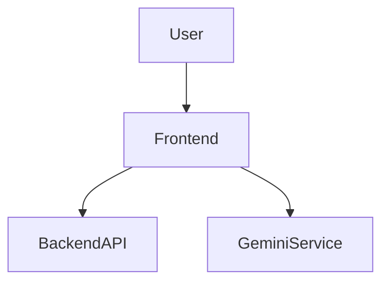
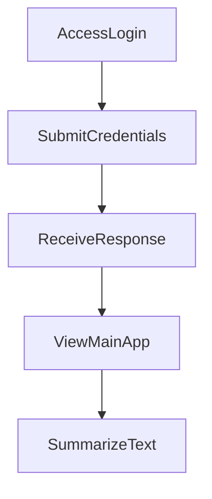

---

# 1. Overview

This project is a web application featuring a user interface built with HTML, CSS, and JavaScript. It provides functionalities such as user authentication, a timer, and potentially content summarization leveraging the Google Gemini API. The application includes a small backend server, handled by `index.js`, which exposes API endpoints for basic interactions like greetings and user login. The presence of several `.html` files (`login.html`, `timer.html`, `summarize.html`, `history.html`, `about.html`) indicates a multi-page user experience.

---

# 2. Architecture Diagram (Mermaid)



---

# 3. Project Workflow (Mermaid + Explanation)

This workflow describes a user logging into the application and then utilizing a core feature like text summarization.



**Explanation:**
1.  **Access Login**: A user navigates to the `login.html` page to begin their session.
2.  **Submit Credentials**: The user enters their username and password on the login form, which is then sent to the backend.
3.  **Receive Response**: The backend processes the login request (`POST /login`) and sends back a response indicating success or failure.
4.  **View Main App**: Upon successful login, the user is redirected to the main application interface, likely `index.html` or a dashboard.
5.  **Summarize Text**: From within the main application, the user navigates to the `summarize.html` page to input text, which is then processed, possibly using the `gemini.js` integration.

---

# 4. API Endpoints

The project includes the following API endpoints, handled by `index.js`:

*   **GET /hello**
    *   **Description**: A simple GET request that likely returns a greeting message. This endpoint can be used for basic connectivity testing or as a straightforward public message.
*   **POST /login**
    *   **Description**: Handles user authentication requests. It expects user credentials (e.g., username and password) to be sent in the request body, and it processes them to verify the user's identity.

---

# 5. Recent Commit History (Last 5)

The most recent commit history indicates a focused effort on documentation. All five latest commits are identical, detailing the auto-generation of the `README.md` using AutoDocs. This suggests that the current development phase is centered around establishing comprehensive project documentation and potentially integrating automated documentation tools. There is no recent activity visible related to new feature development or bug fixes.

---

# 6. File Structure

```
📁 .git
  📄 config
  📄 description
  📄 HEAD
  📁 hooks
    📄 applypatch-msg.sample
    📄 commit-msg.sample
    📄 fsmonitor-watchman.sample
    📄 post-update.sample
    📄 pre-applypatch.sample
    📄 pre-commit.sample
    📄 pre-merge-commit.sample
    📄 pre-push.sample
    📄 pre-rebase.sample
    📄 pre-receive.sample
    📄 prepare-commit-msg.sample
    📄 push-to-checkout.sample
    📄 sendemail-validate.sample
    📄 update.sample
  📄 index
  📁 info
    📄 exclude
  📁 logs
    📄 HEAD
    📁 refs
      📁 heads
        📄 main
      📁 remotes
        📁 origin
          📄 HEAD
  📁 objects
    📁 info
    📁 pack
      📄 pack-27e4bf07a0270fddb1cb8fcbcdd19fd6a02ce474.idx
      📄 pack-27e4bf07a0270fddb1cb8fcbcdd19fd6a02ce474.pack
      📄 pack-27e4bf07a0270fddb1cb8fcbcdd19fd6a02ce474.rev
  📄 packed-refs
  📁 refs
    📁 heads
      📄 main
    📁 remotes
      📁 origin
        📄 HEAD
    📁 tags
📄 .gitignore
📁 .vscode
  📄 launch.json
📄 about.html
📄 alarm.mp3
📄 Cover1.png
📄 gemini.js
📄 history.html
📄 index.html
📄 index.js
📄 login.html
📄 README.md
📄 script.js
📄 style.css
📄 summarize.html
📄 timer.html
```

**Major Folders and Files:**

*   **`.git/`**: Contains all the necessary objects and metadata for the Git version control system.
*   **`.vscode/`**: Holds configuration files specific to Visual Studio Code, such as `launch.json` for debugging settings.
*   **`.gitignore`**: Specifies files and directories that Git should ignore, preventing them from being committed to the repository.
*   **`index.html`**: The main entry point for the web application, serving as the primary landing page after potentially logging in.
*   **`login.html`**: The dedicated page for user authentication.
*   **`about.html`**: Provides information about the project or application.
*   **`history.html`**: Likely displays a log or history of user activities or generated content.
*   **`summarize.html`**: A page dedicated to the text summarization feature.
*   **`timer.html`**: Implements a timer functionality within the application.
*   **`index.js`**: Serves as both the backend server, handling API routes like `/hello` and `/login`, and potentially contains some frontend JavaScript logic.
*   **`script.js`**: Contains general frontend JavaScript logic and interactivity for the web pages.
*   **`style.css`**: Defines the visual styling and layout for the entire web application.
*   **`gemini.js`**: A client-side JavaScript file that likely integrates with the Google Gemini API for AI-powered features, such as the text summarization.
*   **`alarm.mp3`**: An audio asset, possibly used for the timer feature.
*   **`Cover1.png`**: An image asset, potentially used for branding or visual elements.
*   **`README.md`**: This documentation file, providing an overview and details about the project.

---

# 7. AutoDocs Note

This documentation was automatically generated by AutoDocs.