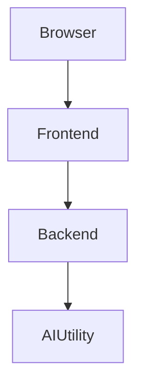
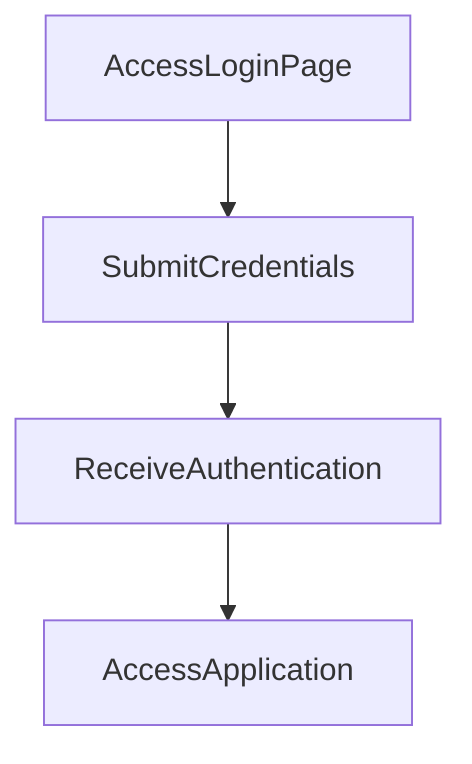

---

# 1. Overview

This project appears to be a web-based application, likely a personal utility or tool, with features for user interaction, content display, and potentially AI-driven summarization. The presence of multiple HTML files (`index.html`, `login.html`, `summarize.html`, `timer.html`, `about.html`, `history.html`), along with client-side JavaScript (`script.js`) and CSS (`style.css`), indicates a frontend user interface. A backend server, handled by `index.js`, provides API functionality, including user authentication (`POST /login`). The `gemini.js` file and `summarize.html` strongly suggest integration with an AI model for text summarization capabilities. Other features like a `timer.html` and `alarm.mp3` hint at a time management or reminder utility. Recent commit history indicates a focus on documentation generation, with earlier development of content.

---

# 2. Architecture Diagram (Mermaid)



---

# 3. Project Workflow (Mermaid + Explanation)

This flow illustrates a user logging into the application and accessing a feature.



**Explanation of Workflow Steps:**

1.  **Access Login Page**: A user opens the application, typically landing on the `login.html` page to begin their session.
2.  **Submit Credentials**: The user enters their username and password into the login form and submits it. This action triggers a `POST /login` request to the backend server.
3.  **Receive Authentication**: The backend server (`index.js`) processes the login request. If the credentials are valid, the server sends an authentication success response back to the frontend.
4.  **Access Application**: Upon successful authentication, the user is redirected to the main part of the application, such as `index.html`, `summarize.html`, or `timer.html`, gaining access to its features.

---

# 4. API Endpoints

The project exposes the following API endpoints:

*   **`GET /hello`** (from `index.js`)
    *   This endpoint likely serves as a basic test or a welcome message from the server. It could be used to verify the server is running and responsive.
*   **`POST /login`** (from `index.js`)
    *   This endpoint handles user authentication. It expects user credentials (e.g., username and password) in the request body, processes them, and authenticates the user, typically returning a session token or success status.

---

# 5. Recent Commit History (Last 5)

*   **a057bbc**: Added content to the `TEST1` file, indicating content creation or feature development.
*   **284f053**: Documentation update for auto-generating the README using AutoDocs.
*   **4362d68**: Documentation update for auto-generating the README using AutoDocs.
*   **269416e**: Documentation update for auto-generating the README using AutoDocs.
*   **6360be8**: Documentation update for auto-generating the README using AutoDocs.

The recent commit history indicates a strong focus on establishing automated documentation for the project. The most recent non-documentation commit suggests that content or basic features were being added and tested.

---

# 6. File Structure

```
📁 .git
  📄 config
  📄 description
  📄 HEAD
  📁 hooks
    📄 applypatch-msg.sample
    📄 commit-msg.sample
    📄 fsmonitor-watchman.sample
    📄 post-update.sample
    📄 pre-applypatch.sample
    📄 pre-commit.sample
    📄 pre-merge-commit.sample
    📄 pre-push.sample
    📄 pre-rebase.sample
    📄 pre-receive.sample
    📄 prepare-commit-msg.sample
    📄 push-to-checkout.sample
    📄 sendemail-validate.sample
    📄 update.sample
  📄 index
  📁 info
    📄 exclude
  📁 logs
    📄 HEAD
    📁 refs
      📁 heads
        📄 main
      📁 remotes
        📁 origin
          📄 HEAD
  📁 objects
    📁 info
    📁 pack
      📄 pack-6b889be8e4a6692d8cf08ac5a79de1981059d64b.idx
      📄 pack-6b889be8e4a6692d8cf08ac5a79de1981059d64b.pack
      📄 pack-6b889be8e4a6692d8cf08ac5a79de1981059d64b.rev
  📄 packed-refs
  📁 refs
    📁 heads
      📄 main
    📁 remotes
      📁 origin
        📄 HEAD
    📁 tags
📄 .gitignore
📁 .vscode
  📄 launch.json
📄 about.html
📄 alarm.mp3
📄 Cover1.png
📄 gemini.js
📄 history.html
📄 index.html
📄 index.js
📄 login.html
📄 README.md
📄 script.js
📄 style.css
📄 summarize.html
📄 test.txt
📄 TEST1
📄 test1.txt
📄 test2.txt
📄 test3.txt
📄 timer.html
```

**Major Files and Folders:**

*   **`.git/`**: Contains all the necessary objects and data that Git uses for version control.
*   **`.vscode/`**: Holds configuration files specific to the VS Code editor, such as debugging settings in `launch.json`.
*   **`index.html`**: The main entry point or home page for the web application's frontend.
*   **`login.html`**: The HTML page dedicated to user authentication and login functionality.
*   **`summarize.html`**: An HTML page likely dedicated to a feature for summarizing text, possibly utilizing AI.
*   **`timer.html`**: An HTML page that implements a timer or countdown functionality.
*   **`about.html`**, **`history.html`**: Additional HTML pages providing information about the project or showing user history.
*   **`style.css`**: Defines the visual styles and layout for all the HTML pages in the frontend.
*   **`script.js`**: Contains client-side JavaScript code for interactive elements, dynamic content, and frontend logic.
*   **`index.js`**: This is likely the backend server file, handling API requests (like `/login`, `/hello`) and possibly serving static frontend files.
*   **`gemini.js`**: Suggests integration with the Gemini AI model or contains utilities related to AI-driven features, potentially used for summarization.
*   **`alarm.mp3`**: An audio file used for an alarm sound, likely associated with the `timer.html` feature.
*   **`Cover1.png`**: An image file, possibly used as a banner, background, or other visual asset.
*   **`test.txt`, `TEST1`, `test1.txt`, `test2.txt`, `test3.txt`**: These files appear to be temporary, experimental, or used for testing purposes during development.

---

# 7. AutoDocs Note

This documentation was automatically generated by AutoDocs.