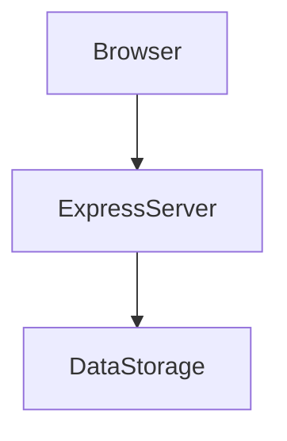
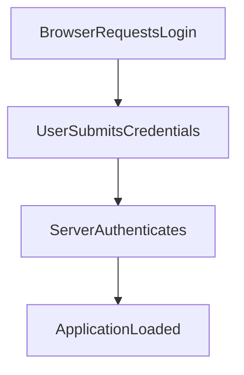

---

# 1. Overview

This project appears to be a web application built with a Node.js Express backend and a client-side frontend using HTML, CSS, and JavaScript. Based on the file names (`login.html`, `timer.html`, `summarize.html`, `gemini.js`, `alarm.mp3`) and commit messages like "Initialize Express server with basic routes" and "Add hello route and improve login response," it seems to provide user authentication and features related to a timer, and potentially AI-driven summarization or interaction, possibly leveraging Google's Gemini API. The presence of `index.html` suggests a main application interface once a user is authenticated.

---

# 2. Architecture Diagram (Mermaid)



---

# 3. Project Workflow (Mermaid + Explanation)

This diagram illustrates a typical user login flow within the application.



**Explanation:**
1.  **Browser Requests Login**: A user accesses the application's login page through their web browser.
2.  **User Submits Credentials**: The user enters their login information (e.g., username and password) into the form on the `login.html` page and submits it. This typically triggers a `POST` request to the backend.
3.  **Server Authenticates**: The `Express Server` (`index.js`) receives the login request via the `POST /login` endpoint. It then processes and validates the provided credentials, potentially against stored user data.
4.  **Application Loaded**: If authentication is successful, the server responds by serving the main application content (e.g., `index.html`), allowing the user to access the application's features like the timer or summarization tools.

---

# 4. API Endpoints

The project currently exposes the following API endpoints from `index.js`:

*   **GET /hello**
    *   This endpoint likely serves as a simple test or welcome message. It might be used to confirm the server is running or to provide a basic greeting after a user has logged in, as indicated by the commit "Add hello route and improve login response."
*   **POST /login**
    *   This endpoint handles user authentication. It expects user credentials (e.g., username and password) to be sent for verification. A successful response would typically grant the user access to the application, while an unsuccessful one would return an error. The commit "improve login response" suggests ongoing refinement of this crucial authentication feature.

---

# 5. Recent Commit History (Last 5)

The recent commit history indicates the project is in an active development phase, focusing on establishing core backend functionality and then moving into documentation.

*   `b950f6c` **Add hello route and improve login response**: This significant commit demonstrates active development on fundamental user interaction, adding a new route and enhancing the user login experience, which is crucial for a web application with authentication.
*   `ffa8bd2` **Initialize Express server with basic routes**: This is the foundational commit, showing the very beginning of the project where the core Express server framework was set up, along with its initial basic API routes.
*   The three subsequent commits (`ceeb686`, `fa5760`, `c966d26`) are related to automatic documentation generation by AutoDocs, indicating a focus on maintaining up-to-date project documentation rather than new feature development in those specific commits.

Overall, the project started with a basic server, quickly implemented and refined login and a simple test route, and is now also incorporating automated documentation processes.

---

# 6. File Structure

```
📁 .git                  # Git version control system directory
  ...                   # Internal Git files
📁 .vscode               # Visual Studio Code workspace settings
  📄 launch.json         # Debugging configurations for VS Code
📄 about.html            # Static page providing information about the project or application
📄 alarm.mp3             # Audio file, likely used for the timer functionality
📄 Cover1.png            # Image file, possibly a placeholder or a cover for the application
📄 gemini.js             # JavaScript file, potentially containing logic for integrating with Google's Gemini API (AI features)
📄 history.html          # Static page to display historical data or activity
📄 index.html            # The main entry point for the client-side web application
📄 index.js              # The main backend server file, written in Node.js with Express
📄 login.html            # The HTML page for user login
📄 README.md             # This documentation file
📄 script.js             # General client-side JavaScript for interactive elements
📄 style.css             # Stylesheet for the web application's visual presentation
📄 summarize.html        # HTML page dedicated to a summarization feature
📄 test.txt              # Placeholder or test file
📄 test1.txt             # Placeholder or test file
📄 test2.txt             # Placeholder or test file
📄 test3.txt             # Placeholder or test file
📄 timer.html            # HTML page for a timer feature
```

---

# 7. AutoDocs Note

This README.md was automatically generated by AutoDocs.

---