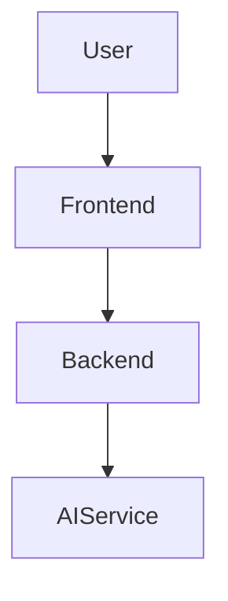
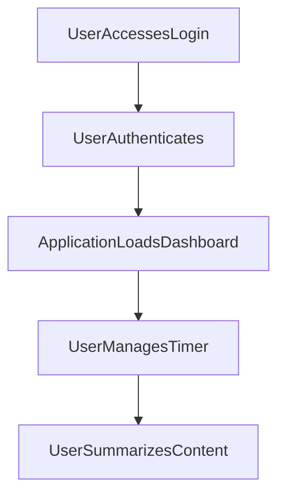

---

# 1. Overview

This project is a web application designed to provide users with productivity tools and an AI-powered content summarizer. It features a multi-page frontend accessible via `index.html`, `login.html`, `timer.html`, `summarize.html`, `history.html`, and `about.html`. Key functionalities include user authentication through a `/login` endpoint, a dedicated timer with an alarm, and content summarization, strongly suggested by the presence of `gemini.js`, indicating integration with the Google Gemini AI model. The backend, handled by `index.js`, serves these pages and provides necessary API interactions, while `script.js` manages client-side behaviors and `style.css` defines the visual presentation.

---

# 2. Architecture Diagram (Mermaid)



---

# 3. Project Workflow (Mermaid + Explanation)



**Explanation of Workflow:**

1.  **User Accesses Login**: A user navigates to the application's login page (`login.html`) to begin their session.
2.  **User Authenticates**: The user provides credentials, which are sent to the `POST /login` API endpoint for verification.
3.  **Application Loads Dashboard**: Upon successful authentication, the user is redirected to the main application interface or a dashboard (`index.html` or similar landing page).
4.  **User Manages Timer**: From the dashboard, the user can navigate to the timer page (`timer.html`) to start, stop, or reset a timer, potentially utilizing the `alarm.mp3` for notifications.
5.  **User Summarizes Content**: The user can then proceed to the summarization page (`summarize.html`) to input text or content, which is processed by the integrated AI service (via `gemini.js`) to generate a summary.

---

# 4. API Endpoints

*   **GET /hello**
    *   **Source**: `index.js`
    *   **Description**: A simple test or greeting endpoint, likely used to confirm the server's operational status.
*   **POST /login**
    *   **Source**: `index.js`
    *   **Description**: Handles user authentication, allowing users to submit their credentials to gain access to the application's features.

---

# 5. Recent Commit History (Last 5)

The most recent commits primarily focus on documentation generation, specifically `docs: auto-generate README using AutoDocs`. This indicates that the project's development currently emphasizes setting up or refining an automated documentation process, suggesting the core features of the application are stable, and the focus has shifted to maintaining up-to-date and automatic project documentation.

---

# 6. File Structure

```
📁 .git
📁 .vscode
📄 about.html
📄 alarm.mp3
📄 Cover1.png
📄 gemini.js
📄 history.html
📄 index.html
📄 index.js
📄 login.html
📄 README.md
📄 script.js
📄 style.css
📄 summarize.html
📄 timer.html
```

*   **`.vscode/`**: Contains Visual Studio Code specific configuration files, such as `launch.json` for debugging setups.
*   **`about.html`**: A static page providing information about the project or application.
*   **`alarm.mp3`**: An audio file used for an alarm sound, likely associated with the timer functionality.
*   **`Cover1.png`**: An image file, potentially used as a cover or banner for the project.
*   **`gemini.js`**: A JavaScript file that integrates with the Google Gemini AI service, likely responsible for handling AI-powered features like summarization.
*   **`history.html`**: A web page that could display a log or history of user activities or previously summarized content.
*   **`index.html`**: The main landing page or entry point for the web application.
*   **`index.js`**: The primary backend server logic, defining API endpoints like `/hello` and `/login`, and serving frontend files.
*   **`login.html`**: The dedicated page for user login and authentication.
*   **`README.md`**: This documentation file, providing an overview of the project.
*   **`script.js`**: A client-side JavaScript file containing interactive logic and functionality for the web pages.
*   **`style.css`**: The stylesheet for the application, defining its visual appearance and layout.
*   **`summarize.html`**: A web page dedicated to the AI-powered content summarization feature.
*   **`timer.html`**: A web page implementing a timer or alarm functionality.

---

# 7. AutoDocs Note

This documentation was automatically generated by AutoDocs.