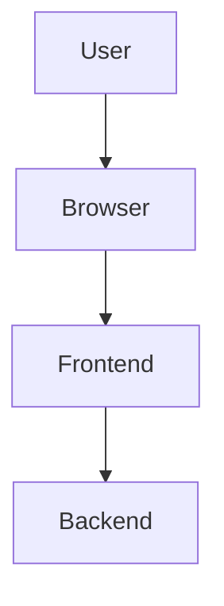
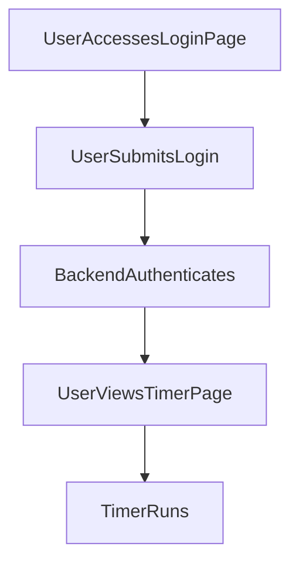

---

# 1. Overview

This project appears to be a web application that provides user authentication and various interactive features. It includes a frontend built with standard web technologies (HTML, CSS, JavaScript) and a backend server handling API requests. Key functionalities suggested by the file structure include user login, an interactive timer with an alarm, and potentially a text summarization tool, possibly leveraging an AI model like Gemini. The presence of multiple HTML pages like `about.html`, `history.html`, and `summarize.html` indicates a multi-page user experience beyond a single utility.

---

# 2. Architecture Diagram (Mermaid)



---

# 3. Project Workflow (Mermaid + Explanation)



**Explanation:**
1.  **User Accesses Login Page:** A user navigates to the application's login interface.
2.  **User Submits Login:** The user enters their credentials and submits the login form.
3.  **Backend Authenticates:** The application's backend receives the login request via the `/login` API endpoint, validates the credentials, and responds accordingly.
4.  **User Views Timer Page:** Upon successful login, the user is directed to the timer functionality page.
5.  **Timer Runs:** The user interacts with the timer, potentially starting, pausing, or stopping it, with an alarm sound available for completion.

---

# 4. API Endpoints

*   **GET /hello** (from `index.js`)
    *   **Description:** A simple greeting endpoint. This is typically used for basic connectivity testing or to provide a general welcome message from the server.
*   **POST /login** (from `index.js`)
    *   **Description:** Handles user authentication requests. Users submit their login credentials to this endpoint to gain access to protected areas of the application.

---

# 5. Recent Commit History (Last 5)

The most recent commits exclusively indicate activities related to documentation generation. All five commits are focused on `docs: auto-generate README using AutoDocs`, suggesting that the primary recent development effort has been on setting up or updating the automatic README generation process rather than introducing new features or fixing bugs in the application's core functionality.

---

# 6. File Structure

```
📁 .git
  📄 config
  📄 description
  📄 HEAD
  📁 hooks
    📄 applypatch-msg.sample
    📄 commit-msg.sample
    📄 fsmonitor-watchman.sample
    📄 post-update.sample
    📄 pre-applypatch.sample
    📄 pre-commit.sample
    📄 pre-merge-commit.sample
    📄 pre-push.sample
    📄 pre-rebase.sample
    📄 pre-receive.sample
    📄 prepare-commit-msg.sample
    📄 push-to-checkout.sample
    📄 sendemail-validate.sample
    📄 update.sample
  📄 index
  📁 info
    📄 exclude
  📁 logs
    📄 HEAD
    📁 refs
      📁 heads
        📄 main
      📁 remotes
        📁 origin
          📄 HEAD
  📁 objects
    📁 info
    📁 pack
      📄 pack-8e8ae91c770b345056baae602b900de1da437150.idx
      📄 pack-8e8ae91c770b345056baae602b900de1da437150.pack
      📄 pack-8e8ae91c770b345056baae602b900de1da437150.rev
  📄 packed-refs
  📁 refs
    📁 heads
      📄 main
    📁 remotes
      📁 origin
        📄 HEAD
    📁 tags
📄 .gitignore
📁 .vscode
  📄 launch.json
📄 about.html
📄 alarm.mp3
📄 Cover1.png
📄 gemini.js
📄 history.html
📄 index.html
📄 index.js
📄 login.html
📄 README.md
📄 script.js
📄 style.css
📄 summarize.html
📄 timer.html
```

**Major Folders and Files:**

*   `index.html`: The main entry point for the client-side web application.
*   `login.html`: Provides the user interface for logging into the application.
*   `timer.html`, `alarm.mp3`: Dedicated page for the timer feature, accompanied by an audio file for the alarm sound.
*   `summarize.html`, `gemini.js`: Suggests a feature related to text summarization, potentially integrating with the Google Gemini API as indicated by `gemini.js`.
*   `index.js`: Contains the backend server logic, handling API endpoints such as `/hello` and `/login`.
*   `script.js`: Client-side JavaScript code for interactive elements and logic within the frontend.
*   `style.css`: Contains the cascading style sheets (CSS) for the visual presentation of the web application.
*   `.vscode`: Configuration files for the Visual Studio Code editor, aiding development.
*   `.git`: Contains all the necessary files for Git version control.

---

# 7. AutoDocs Note

This documentation was automatically generated by AutoDocs.