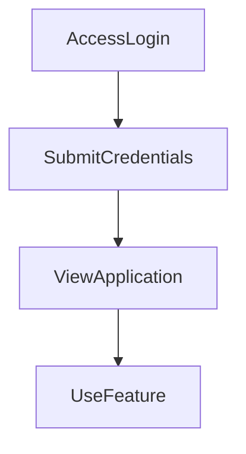

---

# 1. Overview

This project appears to be a web-based application offering various functionalities including user authentication, a timer/alarm, and potentially a content summarization feature with AI integration. It serves multiple HTML pages for different sections like login, about, history, summarization, and a timer. The backend handles basic API requests such as user login, while the frontend manages user interaction, styling, and client-side logic, including an integration with a "Gemini" service, likely for AI-powered features.

---

# 2. Architecture Diagram (Mermaid)

```mermaid
flowchart TD
    BrowserClient --> BackendAPI
    BackendAPI --> GeminiAI
    BrowserClient -.-> GeminiAI : (Direct interaction)
```
- **Browser Client**: Renders HTML pages (`index.html`, `login.html`, `timer.html`, etc.), executes frontend JavaScript (`script.js`), and applies styles (`style.css`).
- **Backend API**: A Node.js server (`index.js`) that handles API requests like user authentication (`/login`) and basic server responses (`/hello`).
- **Gemini AI**: Represents the integration with a "Gemini" service (`gemini.js`), likely for features such as summarization, potentially interacting directly from the client or via the backend.

---

# 3. Project Workflow (Mermaid + Explanation)

This workflow outlines a typical user journey through the application's authentication and feature usage.



1.  **Access Login**: A user navigates to the application's login page (`login.html`) to begin their session.
2.  **Submit Credentials**: The user enters their username and password, which are sent as a `POST /login` request to the backend server (`index.js`) for authentication.
3.  **View Application**: Upon successful login, the user is redirected to the main application dashboard or a default page (`index.html`), gaining access to various features.
4.  **Use Feature**: From the main application, the user can interact with specific functionalities such as starting a timer (`timer.html`) or using the summarization tool (`summarize.html`), which may involve the `gemini.js` integration.

---

# 4. API Endpoints

The following API endpoints have been identified:

*   **GET /hello**
    *   **Source**: `index.js`
    *   **Description**: A simple endpoint likely used for health checks or to return a basic greeting, confirming the server is operational.
*   **POST /login**
    *   **Source**: `index.js`
    *   **Description**: Handles user authentication requests. Users submit their credentials to this endpoint to gain access to the application's features.

---

# 5. Recent Commit History (Last 5)

The recent commit history indicates a strong focus on documentation automation rather than feature development or bug fixes. All the latest five commits are related to the auto-generation of the `README.md` file using AutoDocs.

*   `6360be8` docs: auto-generate README using AutoDocs
*   `45d4b5a` docs: auto-generate README using AutoDocs
*   `c966d26` docs: auto-generate README using AutoDocs
*   `fa576a0` docs: auto-generate README using AutoDocs
*   `ceeb686` docs: auto-generate README using AutoDocs

---

# 6. File Structure

```
📁 .git
  📄 config
  📄 description
  📄 HEAD
  📁 hooks
    📄 applypatch-msg.sample
    📄 commit-msg.sample
    📄 fsmonitor-watchman.sample
    📄 post-update.sample
    📄 pre-applypatch.sample
    📄 pre-commit.sample
    📄 pre-merge-commit.sample
    📄 pre-push.sample
    📄 pre-rebase.sample
    📄 pre-receive.sample
    📄 prepare-commit-msg.sample
    📄 push-to-checkout.sample
    📄 sendemail-validate.sample
    📄 update.sample
  📄 index
  📁 info
    📄 exclude
  📁 logs
    📄 HEAD
    📁 refs
      📁 heads
        📄 main
      📁 remotes
        📁 origin
          📄 HEAD
  📁 objects
    📁 info
    📁 pack
      📄 pack-547106c05ff78d35aa5c881f0f72558f837966c9.idx
      📄 pack-547106c05ff78d35aa5c881f0f72558f837966c9.pack
      📄 pack-547106c05ff78d35aa5c881f0f72558f837966c9.rev
  📄 packed-refs
  📁 refs
    📁 heads
      📄 main
    📁 remotes
      📁 origin
        📄 HEAD
    📁 tags
📄 .gitignore
📁 .vscode
  📄 launch.json
📄 about.html
📄 alarm.mp3
📄 Cover1.png
📄 gemini.js
📄 history.html
📄 index.html
📄 index.js
📄 login.html
📄 README.md
📄 script.js
📄 style.css
📄 summarize.html
📄 test.txt
📄 test1.txt
📄 test2.txt
📄 test3.txt
📄 timer.html
```

*   **HTML Files (`.html`)**: `index.html`, `login.html`, `about.html`, `history.html`, `summarize.html`, `timer.html` represent the various pages and user interfaces of the web application.
*   **`style.css`**: Contains the Cascading Style Sheets (CSS) for styling the application's user interface.
*   **`script.js`**: Holds the primary client-side JavaScript logic for interactive elements and dynamic content on the frontend.
*   **`index.js`**: This file acts as the backend server, handling API requests (like `/login` and `/hello`) and possibly serving static files.
*   **`gemini.js`**: Suggests integration with an external "Gemini" service, likely an AI or language model, used for features like summarization or other intelligent processing.
*   **`alarm.mp3`**: An audio file, likely used for the timer functionality (`timer.html`) to signal completion or alerts.
*   **`Cover1.png`**: An image file, probably used as a static asset for the application's branding or visual elements.
*   **`.vscode/`**: Contains configuration files for Visual Studio Code, such as `launch.json` for debugging settings.
*   **`.git/`**: The Git repository directory, containing all version control metadata for the project.
*   **`.gitignore`**: Specifies files and directories that Git should ignore and not track.
*   **`test*.txt`**: Placeholder or temporary text files, possibly used for testing or development notes.
*   **`README.md`**: This documentation file, automatically generated.

---

# 7. AutoDocs Note

This documentation was automatically generated by AutoDocs.

---