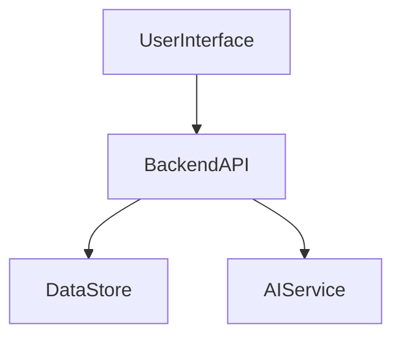
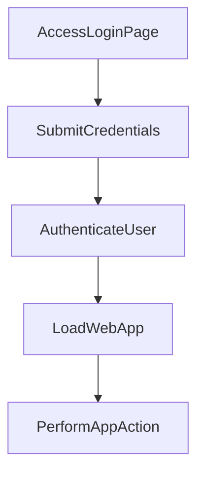

---

# 1. Overview

This project appears to be a web application designed to offer user authentication, a timer/alarm functionality, and potentially an AI-powered summarization feature. The presence of distinct HTML pages like `login.html`, `timer.html`, `summarize.html`, and `history.html`, alongside client-side scripts (`script.js`, `style.css`) and a backend server (`index.js`), indicates a full-stack web application. The `alarm.mp3` file strongly suggests the timer feature includes an audible alert. Furthermore, `gemini.js` hints at integration with the Gemini AI service, likely for the summarization component.

---

# 2. Architecture Diagram (Mermaid)



---

# 3. Project Workflow (Mermaid + Explanation)

This workflow describes a user logging into the application and then performing a core action within the application.



**AccessLoginPage:** A user navigates to the application's login interface.
**SubmitCredentials:** The user enters their username and password on the login page.
**AuthenticateUser:** The submitted credentials are sent to the backend API for validation against stored user data.
**LoadWebApp:** Upon successful authentication, the main web application interface, potentially displaying options like the timer or summarizer, is loaded for the user.
**PerformAppAction:** The user interacts with the application, for example, by starting a timer, generating a summary, or viewing their history.

---

# 4. API Endpoints

**GET /hello**
- **Purpose:** A simple endpoint typically used for testing server availability or providing a basic welcome message.

**POST /login**
- **Purpose:** Handles user authentication. It expects user credentials (e.g., username and password) to be sent, validates them, and typically responds with a token or session indicator for subsequent authenticated requests.

---

# 5. Recent Commit History (Last 5)

The recent commit history indicates a focus on documentation and minor testing activities:
- `e3eeb71`, `99abdd8`, `a2283e8`: These three commits are related to the automatic generation of the README using AutoDocs, suggesting a recent integration or update of the documentation process.
- `95d5b24`, `2895a57`: These commits show the creation and subsequent deletion of a test file, indicating some development or testing experimentation that was later reverted.

---

# 6. File Structure

```
📁 .git                  # Git version control metadata
  📄 config
  📄 description
  📄 HEAD
  📁 hooks
    📄 applypatch-msg.sample
    📄 commit-msg.sample
    📄 fsmonitor-watchman.sample
    📄 post-update.sample
    📄 pre-applypatch.sample
    📄 pre-commit.sample
    📄 pre-merge-commit.sample
    📄 pre-push.sample
    📄 pre-rebase.sample
    📄 pre-receive.sample
    📄 prepare-commit-msg.sample
    📄 push-to-checkout.sample
    📄 sendemail-validate.sample
    📄 update.sample
  📄 index
  📁 info
    📄 exclude
  📁 logs
    📄 HEAD
    📁 refs
      📁 heads
        📄 main
      📁 remotes
        📁 origin
          📄 HEAD
  📁 objects
    📁 info
    📁 pack
      📄 pack-be025a2fa6bf4647449d20fd44544f48b95caa1e.idx
      📄 pack-be025a2fa6bf4647449d20fd44544f48b95caa1e.pack
      📄 pack-be025a2fa6bf4647449d20fd44544f48b95caa1e.rev
  📄 packed-refs
  📁 refs
    📁 heads
      📄 main
    📁 remotes
      📁 origin
        📄 HEAD
    📁 tags
📄 .gitignore            # Specifies intentionally untracked files to ignore
📁 .vscode               # Visual Studio Code specific settings
  📄 launch.json
📄 about.html            # Frontend HTML page, likely containing information about the project
📄 alarm.mp3             # Audio file, probably used as an alarm sound for the timer feature
📄 Cover1.png            # Image file, possibly for branding, a favicon, or a UI element
📄 gemini.js             # Client-side JavaScript for interacting with the Gemini AI API
📄 history.html          # Frontend HTML page for displaying user history or past activities
📄 index.html            # The main entry point or homepage of the web application
📄 index.js              # The backend server logic, handling API routes and server-side operations
📄 login.html            # Frontend HTML page for user login
📄 README.md             # This documentation file
📄 script.js             # General client-side JavaScript for interactive functionality
📄 style.css             # Stylesheet for the web application's visual presentation
📄 summarize.html        # Frontend HTML page for the summarization feature
📄 timer.html            # Frontend HTML page for the timer/alarm functionality
```

---

# 7. AutoDocs Note

This documentation was automatically generated by AutoDocs.