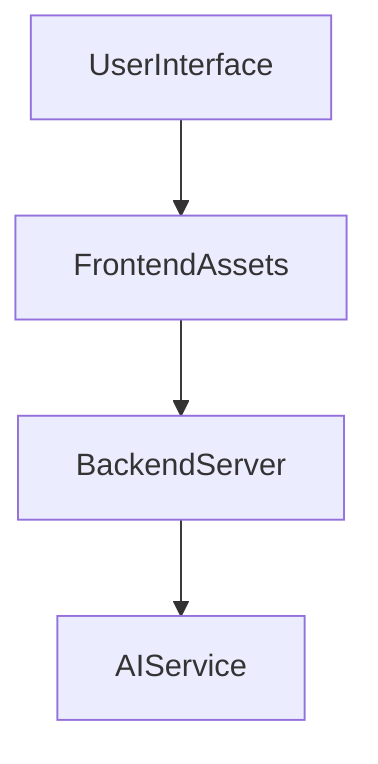
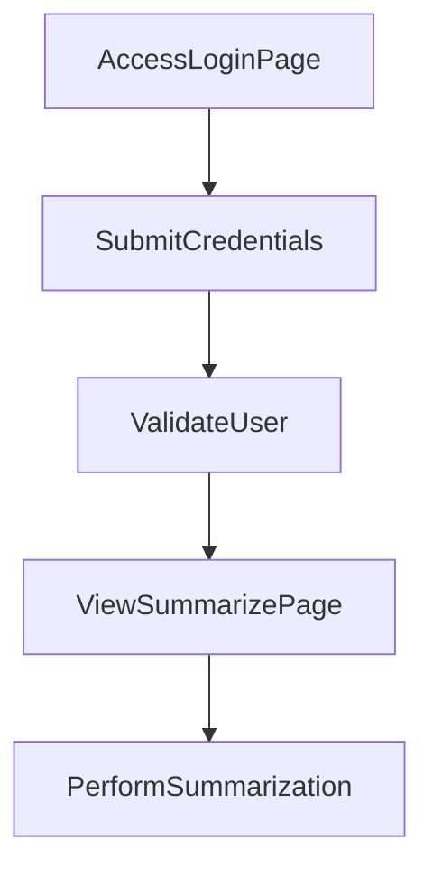

---

# 1. Overview

This project functions as a web application, serving various static HTML pages for user interaction. It includes a backend server handled by Node.js, which provides basic API functionality for operations like user login. The frontend integrates with several features such as a timer, an alarm sound, and a summarization tool, likely powered by an AI service (indicated by `gemini.js`). The application appears to support user authentication, allowing access to its features.

---

# 2. Architecture Diagram (Mermaid)



---

# 3. Project Workflow (Mermaid + Explanation)

This workflow describes a user logging in and then accessing a content summarization feature.



**Step-by-step Explanation:**
1.  **Access Login Page:** A user navigates to the `/login.html` page to begin their session.
2.  **Submit Credentials:** The user enters their username and password and submits the login form. This action likely triggers a `POST` request to the `/login` endpoint.
3.  **Validate User:** The backend server (`index.js`) receives the credentials and attempts to validate the user.
4.  **View Summarize Page:** Upon successful authentication, the user is redirected or navigates to the `/summarize.html` page, where they can utilize the summarization feature.
5.  **Perform Summarization:** The user provides content on the summarization page, and the application, potentially using `gemini.js`, processes it to generate a summary.

---

# 4. API Endpoints

The project exposes the following API endpoints through `index.js`:

*   **GET `/hello`**
    *   **Description:** A simple endpoint for testing the server's availability or providing a basic welcome message.
*   **POST `/login`**
    *   **Description:** Handles user authentication. This endpoint expects user credentials to be sent and validates them to log a user into the application.

---

# 5. Recent Commit History (Last 5)

The recent commit history indicates a focus on testing activities and documentation generation.

*   **ef7a432** Create Test 3
    *   Adds a new test file or related content, suggesting ongoing development or debugging efforts.
*   **c20657e** docs: auto-generate README using AutoDocs
    *   A meta-commit indicating the use of an automatic documentation tool to generate the project's README.
*   **58c286b** Create TEST2
    *   Another commit related to creating test files, continuing the pattern of development and testing.
*   **9351e63** docs: auto-generate README using AutoDocs
    *   Another instance of automatic README generation, possibly after changes.
*   **a057bbc** Add content to TEST1 file
    *   Modifies an existing test file, further highlighting a phase of development and verification.

---

# 6. File Structure

```
📁 .git                          # Git version control system files
📁 .vscode                       # Visual Studio Code editor configuration
📄 .gitignore                    # Specifies files and directories to be ignored by Git
📄 about.html                    # Frontend page with information about the project
📄 alarm.mp3                     # Audio file used for an alarm feature
📄 Cover1.png                    # Image asset for the frontend
📄 gemini.js                     # JavaScript file likely for integrating with Gemini AI, possibly for summarization
📄 history.html                  # Frontend page to display historical data or actions
📄 index.html                    # The main entry point or home page of the web application
📄 index.js                      # Backend server file (Node.js) containing API routes and server logic
📄 login.html                    # Frontend page for user authentication
📄 README.md                     # This documentation file
📄 script.js                     # General frontend JavaScript logic for interactive elements
📄 style.css                     # Frontend stylesheet for visual presentation
📄 summarize.html                # Frontend page dedicated to content summarization
📄 Test 3                        # Likely a temporary or test file
📄 test.txt                      # A general text file, possibly for testing
📄 TEST1                         # Likely a temporary or test file
📄 test1.txt                     # A general text file, possibly for testing
📄 TEST2                         # Likely a temporary or test file
📄 test2.txt                     # A general text file, possibly for testing
📄 test3.txt                     # A general text file, possibly for testing
📄 timer.html                    # Frontend page implementing a timer feature
```

---

# 7. AutoDocs Note

This documentation was automatically generated by AutoDocs.