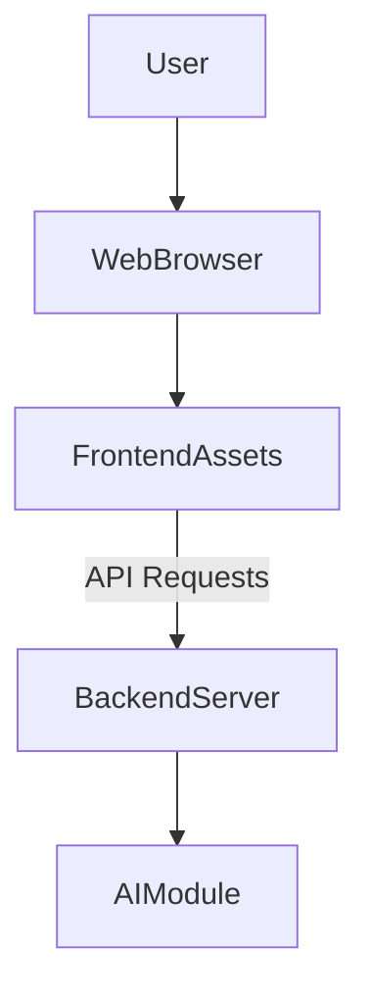
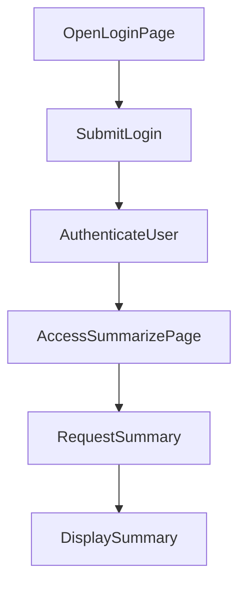

---

# 1. Overview

This project appears to be a web application offering several interactive features. It includes a frontend built with HTML, CSS, and JavaScript, providing distinct pages for user login, an 'about' section, a history log, a timer, and a summarization tool. The presence of `gemini.js` strongly suggests an integration of AI capabilities, likely for text processing functionalities such as summarization. On the backend, `index.js` serves as a Node.js server, handling API endpoints for core functions like user authentication (`/login`) and basic server status checks (`/hello`). The application combines client-side interactivity with server-side processing to deliver a dynamic user experience.

---

# 2. Architecture Diagram (Mermaid)



---

# 3. Project Workflow (Mermaid + Explanation)



**Workflow Explanation:**

1.  **Open Login Page**: A user navigates to the application's login interface, typically by accessing `login.html` or the application's root.
2.  **Submit Login**: The user enters their credentials into the provided form and submits them, triggering a `POST /login` request to the backend.
3.  **Authenticate User**: The backend server, handled by `index.js`, receives the login request and verifies the user's credentials.
4.  **Access Summarize Page**: Upon successful authentication, the user is directed to the summarization feature, typically presented via `summarize.html`.
5.  **Request Summary**: On the summarization page, the user provides text input and initiates the summarization process. This action likely sends the text to the backend.
6.  **Display Summary**: The application processes the text (potentially leveraging the `gemini.js` module on the backend), generates a summary, and presents it to the user on the `summarize.html` page.

---

# 4. API Endpoints

-   **GET /hello** (from `index.js`): This endpoint serves as a basic server health check or a simple greeting. It can be used to confirm that the server is running and responsive.
-   **POST /login** (from `index.js`): This endpoint is responsible for handling user authentication. Users submit their login credentials (e.g., username and password) to this endpoint, and the server processes them for verification.

---

# 5. Recent Commit History (Last 5)

The recent commit history primarily indicates a focus on documentation efforts. All the listed commits are related to the automatic generation of the `README.md` file using AutoDocs, suggesting an emphasis on maintaining up-to-date and standardized project documentation.

---

# 6. File Structure

```
📁 .git
  📄 config
  📄 description
  📄 HEAD
  📁 hooks
    📄 applypatch-msg.sample
    📄 commit-msg.sample
    📄 fsmonitor-watchman.sample
    📄 post-update.sample
    📄 pre-applypatch.sample
    📄 pre-commit.sample
    📄 pre-merge-commit.sample
    📄 pre-push.sample
    📄 pre-rebase.sample
    📄 pre-receive.sample
    📄 prepare-commit-msg.sample
    📄 push-to-checkout.sample
    📄 sendemail-validate.sample
    📄 update.sample
  📄 index
  📁 info
    📄 exclude
  📁 logs
    📄 HEAD
    📁 refs
      📁 heads
        📄 main
      📁 remotes
        📁 origin
          📄 HEAD
  📁 objects
    📁 info
    📁 pack
      📄 pack-3e085e7dfc9f69177b2b43488938e6273a314711.idx
      📄 pack-3e085e7dfc9f69177b2b43488938e6273a314711.pack
      📄 pack-3e085e7dfc9f69177b2b43488938e6273a314711.rev
  📄 packed-refs
  📁 refs
    📁 heads
      📄 main
    📁 remotes
      📁 origin
        📄 HEAD
    📁 tags
📄 .gitignore
📁 .vscode
  📄 launch.json
📄 about.html
📄 alarm.mp3
📄 Cover1.png
📄 gemini.js
📄 history.html
📄 index.html
📄 index.js
📄 login.html
📄 README.md
📄 script.js
📄 style.css
📄 summarize.html
📄 timer.html
```

-   **index.html**: The primary HTML file, serving as the main entry point or landing page for the web application.
-   **login.html, about.html, history.html, summarize.html, timer.html**: These HTML files represent distinct sections or features of the application, such as user login, general information, past activities, a text summarization tool, and a timer function.
-   **style.css**: Contains the cascading style sheets that define the visual presentation and layout of the web application's user interface.
-   **script.js**: Holds client-side JavaScript code, providing interactive functionality and dynamic content updates for the frontend.
-   **index.js**: Functions as the backend server script, defining and handling API endpoints like `/hello` and `/login`, along with other server-side logic.
-   **gemini.js**: Suggests the presence of AI-related functionality, likely for natural language processing tasks such as summarization, integrated into the application's logic.
-   **alarm.mp3**: An audio asset, most probably used for the timer or alarm feature of the application.
-   **.vscode/**: This directory contains configuration files specific to Visual Studio Code, aiding in development environment setup and debugging.
-   **.git/**: The standard Git repository directory, which tracks all version control information and history for the project.
-   **.gitignore**: Specifies files and directories that Git should ignore, preventing them from being committed to the repository (e.g., node modules, build outputs, or sensitive data).

---

# 7. AutoDocs Note

This documentation was automatically generated by AutoDocs.