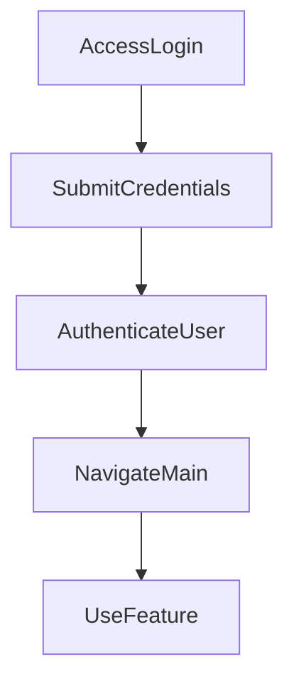

---

# 1. Overview

This project appears to be a web-based application focused on personal productivity, likely offering tools like a timer, a summarization feature, and possibly tracking user history. It includes a user authentication system (`login.html`, POST /login) and a core interface (`index.html`, `script.js`). The presence of `gemini.js` suggests integration with Google's Gemini AI, likely for the summarization functionality. Frontend components are built using HTML, CSS, and JavaScript, while a simple backend (`index.js`) handles basic server requests and user login. The recent commit history indicates a cleanup phase, removing test files.

---

# 2. Architecture Diagram (Mermaid)

```mermaid
flowchart TD
    User --> "Frontend Application"
    "Frontend Application" -- Authenticates & Data --> "Backend Server"
    "Frontend Application" -- AI Capabilities --> "Gemini Integration"
```

---

# 3. Project Workflow (Mermaid + Explanation)

This workflow describes a typical user journey, from accessing the application to utilizing its features.



**Explanation:**

1.  **Access Login Page**: A user first navigates to the application's login page (`login.html`).
2.  **Submit Credentials**: The user enters their username and password and submits the login form.
3.  **Authenticate User**: The application's backend (`index.js`) receives the credentials via the POST `/login` endpoint, verifies them, and if successful, establishes a session.
4.  **Navigate Main**: Upon successful authentication, the user is redirected to the main application dashboard (`index.html`) or a specific feature page.
5.  **Use Feature**: From the main application, the user can then interact with various features such as starting a timer (`timer.html`), viewing history (`history.html`), or using the summarization tool (`summarize.html`) which might leverage the Gemini AI integration.

---

# 4. API Endpoints

The project exposes the following API endpoints through `index.js`:

*   **GET /hello**
    *   **Purpose**: This is a simple endpoint likely used for health checks or as a basic test to ensure the server is running and reachable. It typically returns a greeting or confirmation message.
*   **POST /login**
    *   **Purpose**: This endpoint handles user authentication. It expects to receive user credentials (e.g., username and password) to verify the user's identity and initiate a logged-in session.

---

# 5. Recent Commit History (Last 5)

*   `f315c6b`: Delete test1.txt
*   `a601cb9`: Delete test 5
*   `fd9b13c`: Delete Test 4
*   `dc3c95d`: Delete Test 3
*   `2d1a358`: Delete TEST2

The recent commit history indicates a focus on cleaning up the repository. All recorded commits involve the deletion of various test files (e.g., `test1.txt`, `Test 5`). This suggests the project maintainers are removing temporary or obsolete files, likely after development or testing phases, to streamline the codebase. There's no visible feature development in the immediate past, but rather maintenance and tidying.

---

# 6. File Structure

```
📁 .git
  📄 config
  📄 description
  📄 HEAD
  📁 hooks
    📄 applypatch-msg.sample
    📄 commit-msg.sample
    📄 fsmonitor-watchman.sample
    📄 post-update.sample
    📄 pre-applypatch.sample
    📄 pre-commit.sample
    📄 pre-merge-commit.sample
    📄 pre-push.sample
    📄 pre-rebase.sample
    📄 pre-receive.sample
    📄 prepare-commit-msg.sample
    📄 push-to-checkout.sample
    📄 sendemail-validate.sample
    📄 update.sample
  📄 index
  📁 info
    📄 exclude
  📁 logs
    📄 HEAD
    📁 refs
      📁 heads
        📄 main
      📁 remotes
        📁 origin
          📄 HEAD
  📁 objects
    📁 info
    📁 pack
      📄 pack-fe8f78435a9b620c001d5760924c6a6c6b4ea2dc.idx
      📄 pack-fe8f78435a9b620c001d5760924c6a6c6b4ea2dc.pack
      📄 pack-fe8f78435a9b620c001d5760924c6a6c6b4ea2dc.rev
  📄 packed-refs
  📁 refs
    📁 heads
      📄 main
    📁 remotes
      📁 origin
        📄 HEAD
    📁 tags
📄 .gitignore
📁 .vscode
  📄 launch.json
📄 about.html
📄 alarm.mp3
📄 Cover1.png
📄 gemini.js
📄 history.html
📄 index.html
📄 index.js
📄 login.html
📄 README.md
📄 script.js
📄 style.css
📄 summarize.html
📄 timer.html
```

*   **`.git/`**: This directory contains all the information Git needs to manage the repository's version control.
*   **`.vscode/`**: Contains configuration files specific to Visual Studio Code, such as `launch.json` for debugger settings.
*   **`.gitignore`**: Specifies intentionally untracked files that Git should ignore.
*   **`*.html` files (e.g., `index.html`, `login.html`, `timer.html`, `summarize.html`, `history.html`, `about.html`)**: These are the frontend web pages that provide the structure and content for the user interface.
*   **`style.css`**: Defines the visual styling and layout for the HTML pages.
*   **`script.js`**: Client-side JavaScript code responsible for interactivity and dynamic behavior on the web pages.
*   **`index.js`**: This file likely serves as the backend server for the application, handling API requests like `/login` and `/hello`.
*   **`gemini.js`**: Contains JavaScript logic related to integrating with Google's Gemini AI, likely for features such as text summarization.
*   **`alarm.mp3`**: An audio file, most probably used in conjunction with the timer functionality.
*   **`Cover1.png`**: An image file, potentially used as a visual asset for the application's branding or main page.
*   **`README.md`**: This document, providing an overview and details about the project.

---

# 7. AutoDocs Note

This documentation was automatically generated by AutoDocs.