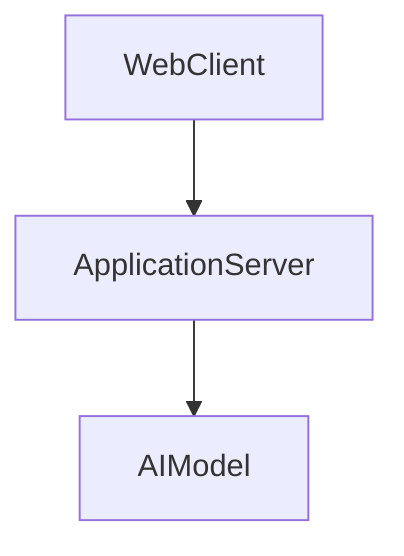
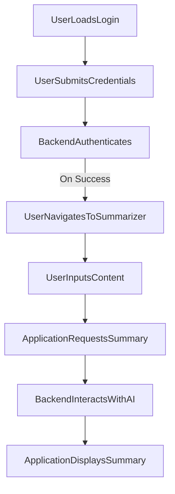

---

# 1. Overview

This project appears to be a web application offering various tools and information, including user authentication, a timer, and a content summarization feature. The presence of `index.html`, `login.html`, `about.html`, `history.html`, `timer.html`, and `summarize.html` indicates a multi-page frontend interface. The `index.js` file likely serves as the backend server, handling API requests such as user login and potentially processing data for the summarization feature, suggested by `gemini.js`. Frontend logic is handled by `script.js` and styling by `style.css`. Recent commits indicate ongoing development and cleanup.

---

# 2. Architecture Diagram (Mermaid)



---

# 3. Project Workflow (Mermaid + Explanation)

This workflow describes how a user might interact with the application to access and utilize the summarization feature.



**Explanation:**
1.  **User Loads Login**: The user first accesses the `login.html` page in their web browser.
2.  **User Submits Credentials**: The user enters their username and password on the login page.
3.  **Backend Authenticates**: The application sends the user's credentials to the `ApplicationServer` (via `POST /login`), which verifies them.
4.  **User Navigates To Summarizer**: If authentication is successful, the user is redirected or navigates to the `summarize.html` page.
5.  **User Inputs Content**: On the summarizer page, the user provides text or content they wish to have summarized.
6.  **Application Requests Summary**: The web client sends this content to the `ApplicationServer` for processing.
7.  **Backend Interacts With AI**: The `ApplicationServer` uses the logic related to `gemini.js` to communicate with an external `AIModel` to generate a summary.
8.  **Application Displays Summary**: The `AIModel` returns the summary to the `ApplicationServer`, which then sends it back to the web client for display on the `summarize.html` page.

---

# 4. API Endpoints

The following API endpoints have been identified in `index.js`:

*   **`GET /hello`**
    *   **Description:** A basic endpoint that likely returns a simple greeting or status message. It can be used to verify the server is running and responsive.
*   **`POST /login`**
    *   **Description:** Handles user authentication. Users would send their credentials to this endpoint to log into the application. Upon successful authentication, it might return a session token or a success message.

---

# 5. Recent Commit History (Last 5)

The recent commit history indicates a phase of active development and cleanup.
*   **`95d5b24 Delete test 1`**: Cleanup of a previously created test.
*   **`2895a57 Create test 1`**: Introduction of a new test file or component.
*   **`7cf131d docs: auto-generate README using AutoDocs`**: This commit explicitly shows an effort to automate documentation, suggesting a focus on project clarity and maintainability.
*   **`f315c6b Delete test1.txt`**: Further cleanup, removing a specific test file.
*   **`a601cb9 Delete test 5`**: Removal of another test asset.

Overall, the recent commits suggest a development cycle that involves creating and then removing test-related files, along with an initiative to improve project documentation.

---

# 6. File Structure

```
📁 .git
  📄 config
  📄 description
  📄 FETCH_HEAD
  📄 HEAD
  📁 hooks
    📄 applypatch-msg.sample
    📄 commit-msg.sample
    📄 fsmonitor-watchman.sample
    📄 post-update.sample
    📄 pre-applypatch.sample
    📄 pre-commit.sample
    📄 pre-merge-commit.sample
    📄 pre-push.sample
    📄 pre-rebase.sample
    📄 pre-receive.sample
    📄 prepare-commit-msg.sample
    📄 sendemail-validate.sample
    📄 update.sample
  📄 index
  📁 info
    📄 exclude
  📁 logs
    📄 HEAD
    📁 refs
      📁 heads
        📄 main
      📁 remotes
        📁 origin
          📄 HEAD
  📁 objects
    📁 info
    📁 pack
      📄 pack-cf9cf458084467efe9586312e9e7a34b66fde7c2.idx
      📄 pack-cf9cf458084467efe9586312e9e7a34b66fde7c2.pack
      📄 pack-cf9cf458084467efe9586312e9e7a34b66fde7c2.rev
  📄 packed-refs
  📁 refs
    📁 heads
      📄 main
    📁 remotes
      📁 origin
        📄 HEAD
    📁 tags
📄 .gitignore
📁 .vscode
  📄 launch.json
📄 about.html
📄 alarm.mp3
📄 Cover1.png
📄 gemini.js
📄 history.html
📄 index.html
📄 index.js
📄 login.html
📄 README.md
📄 script.js
📄 style.css
📄 summarize.html
📄 timer.html
```

**Major Folders and Files:**

*   **`.git/`**: Contains all the necessary objects and metadata for Git version control.
*   **`.vscode/`**: Holds configuration files specific to the VS Code editor, such as `launch.json` for debugging settings.
*   **`about.html`**: A static page likely providing information about the project or application.
*   **`alarm.mp3`**: An audio asset, probably used for the timer feature.
*   **`Cover1.png`**: An image asset, potentially a cover or background for the application UI.
*   **`gemini.js`**: A JavaScript file that likely contains logic for interacting with the Google Gemini AI, particularly for the summarization feature.
*   **`history.html`**: A page possibly displaying a log or history of user activities or summaries.
*   **`index.html`**: The main entry point for the web application, typically the home page.
*   **`index.js`**: The primary backend server script, responsible for handling API routes and overall server logic.
*   **`login.html`**: The user interface for the login functionality.
*   **`README.md`**: This documentation file.
*   **`script.js`**: Client-side JavaScript for interactive elements and frontend logic across the web pages.
*   **`style.css`**: Defines the visual styling and layout for the web application's frontend.
*   **`summarize.html`**: A dedicated page for the text summarization feature.
*   **`timer.html`**: A page dedicated to a timer functionality.

---

# 7. AutoDocs Note

This documentation was automatically generated by AutoDocs.