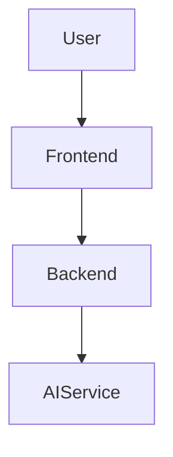
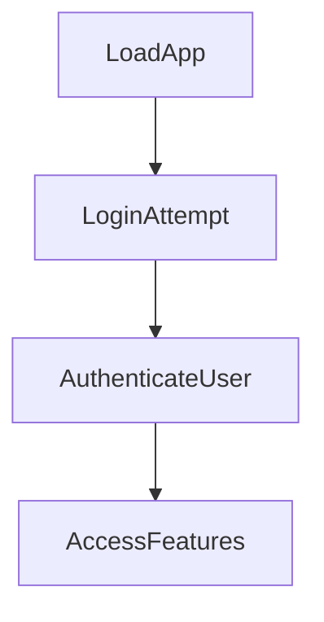

---

# 1. Overview

This project appears to be a client-side web application with a supporting backend server. It provides a user interface for various utilities, including information pages (`about.html`, `history.html`), a timer/alarm feature (`timer.html`, `alarm.mp3`), and potentially an AI-powered summarization tool (`summarize.html`, `gemini.js`). The backend, implemented in `index.js`, handles core functionalities such as user login and basic server interaction. The combination of HTML, CSS, and client-side JavaScript indicates a dynamic frontend, while the Node.js `index.js` provides necessary server-side logic and API endpoints.

---

# 2. Architecture Diagram (Mermaid)



---

# 3. Project Workflow (Mermaid + Explanation)

This workflow outlines a typical user interaction from accessing the application to utilizing its features.



**Explanation:**

*   **LoadApp**: A user navigates to the application's main page (`index.html`) or the login page (`login.html`) in their web browser.
*   **LoginAttempt**: The user inputs their credentials into the login form and attempts to log in via the `POST /login` API endpoint.
*   **AuthenticateUser**: The backend server processes the login request, authenticates the user, and responds with the appropriate status.
*   **AccessFeatures**: Upon successful authentication, the user can then access various features of the application, such as viewing history, using the timer, or accessing the summarization tool.

---

# 4. API Endpoints

*   **GET /hello**:
    *   **Location**: `index.js`
    *   **Description**: A simple endpoint typically used for testing server connectivity or as a basic welcome message. It signifies that the backend server is operational and can respond to requests.

*   **POST /login**:
    *   **Location**: `index.js`
    *   **Description**: This endpoint handles user authentication. It expects user credentials (e.g., username and password) to be sent in the request body, processes them, and attempts to log the user into the application.

---

# 5. Recent Commit History (Last 5)

The most recent commits indicate a focus on documentation automation rather than core feature development. All five latest commits are related to "auto-generate README using AutoDocs", suggesting that the project has recently implemented or refined an automated documentation generation process.

---

# 6. File Structure

```
📁 .git
  📄 config
  📄 description
  📄 HEAD
  📁 hooks
  📄 index
  📁 info
  📁 logs
  📁 objects
  📄 packed-refs
  📁 refs
📄 .gitignore
📁 .vscode
  📄 launch.json
📄 about.html
📄 alarm.mp3
📄 Cover1.png
📄 gemini.js
📄 history.html
📄 index.html
📄 index.js
📄 login.html
📄 README.md
📄 script.js
📄 style.css
📄 summarize.html
📄 test.txt
📄 test1.txt
📄 test2.txt
📄 test3.txt
📄 timer.html
```

**Major Folders and Files:**

*   **`.git/`**: Contains all the necessary objects and metadata for the Git version control system.
*   **`.vscode/`**: Holds configuration files specific to Visual Studio Code, such as `launch.json` for debugging settings.
*   **`*.html` files (e.g., `index.html`, `login.html`, `about.html`, `history.html`, `summarize.html`, `timer.html`)**: These are the frontend web pages that constitute the user interface of the application, each serving a specific purpose or feature.
*   **`style.css`**: Defines the visual styling and layout for the HTML pages.
*   **`script.js`**: Contains client-side JavaScript logic, likely handling user interactions, dynamic content updates, and fetching data from the backend.
*   **`index.js`**: This is the main entry point for the backend server, implemented in Node.js. It defines and handles API routes like `/hello` and `/login`.
*   **`gemini.js`**: Suggests integration with the Gemini AI model or a related service, potentially for tasks like text summarization as hinted by `summarize.html`.
*   **`alarm.mp3`**: An audio file, likely used in conjunction with the `timer.html` page to provide an audible alarm notification.
*   **`README.md`**: This documentation file, providing an overview and details of the project.

---

# 7. AutoDocs Note

This documentation was automatically generated by AutoDocs.