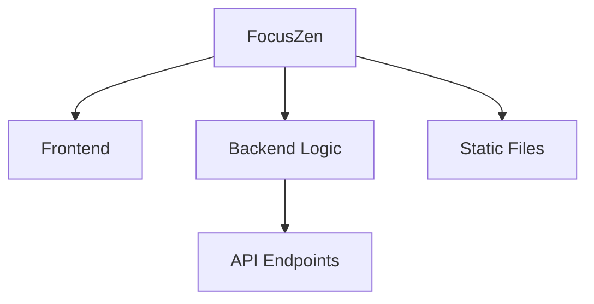

# 1. Overview
FocusZen appears to be a web-based productivity application designed to help users manage their focus and potentially track their activity. The project utilizes a backend built with Express.js (`index.js`) to handle server-side logic, including user authentication (`POST /login`) and basic API responses (`GET /hello`). The frontend consists of various HTML files (`index.html`, `login.html`, `timer.html`, `history.html`, `summarize.html`, `about.html`) styled with `style.css` and enhanced with `script.js`. The presence of `timer.html` and `alarm.mp3` strongly suggests a focus timer or pomodoro-like functionality. Additionally, `gemini.js` and `summarize.html` hint at potential integration with AI models (like Google Gemini) for text summarization or other AI-powered features. The combination of static assets and a backend API points to a full-stack web application focused on enhancing user productivity.

---

# 2. Architecture Diagram (Mermaid)



---

# 3. Project Workflow (Mermaid + explanation)

```mermaid
graph TD
    A[User] --> B{Access Web App}
    B --> C[Frontend (HTML/CSS/JS)]
    C -- "Serves Static Pages" --> D[Backend (Express.js)]
    C -- "API Request (e.g., /login, /hello)" --> D
    D -- "Process Request" --> E[API Endpoints]
    E -- "Database Interaction (Implied for Login)" --> F[Data Storage (e.g., for user credentials)]
    D -- "Serve API Response / Data" --> C
    C --> G[Display UI / Functionality (Timer, History, Summary)]
```

**Explanation:**
The user initiates interaction by accessing the FocusZen web application through their browser. The web app's frontend, comprising HTML pages, CSS stylesheets, and JavaScript files, is then served to the user. This frontend communicates with the backend, an Express.js server, for dynamic functionalities such as user authentication (e.g., handling `POST /login` requests) or retrieving basic information (`GET /hello`). The backend processes these API requests, potentially interacts with a data store for operations like user verification, and sends back appropriate responses. The frontend then utilizes these responses to update the user interface, manage functionalities like the focus timer, display session history, or provide text summarization features. Static assets like `alarm.mp3` are also served to enhance the user experience, particularly for timer functionalities.

---

# 4. API Endpoints
- **GET /hello** (from \index.js)
- **POST /login** (from \index.js)

---

# 5. Recent Commit History (Last 5)

- **b950f6c** — Add hello route and improve login response (yogithasivakumar)
- **ffa8bd2** — Initialize Express server with basic routes (yogithasivakumar)
- **7b72075** — commit test5 (yogithasivakumar)
- **784ee5f** — commit test5 (yogithasivakumar)
- **37fa2a9** — commit test5 (yogithasivakumar)

---

# 6. File Structure

```
📁 .git
  📄 config
  📄 description
  📄 HEAD
  📁 hooks
    📄 applypatch-msg.sample
    📄 commit-msg.sample
    📄 fsmonitor-watchman.sample
    📄 post-update.sample
    📄 pre-applypatch.sample
    📄 pre-commit.sample
    📄 pre-merge-commit.sample
    📄 pre-push.sample
    📄 pre-rebase.sample
    📄 pre-receive.sample
    📄 prepare-commit-msg.sample
    📄 push-to-checkout.sample
    📄 sendemail-validate.sample
    📄 update.sample
  📄 index
  📁 info
    📄 exclude
  📁 logs
    📄 HEAD
    📁 refs
      📁 heads
        📄 main
      📁 remotes
        📁 origin
          📄 HEAD
  📁 objects
    📁 info
    📁 pack
      📄 pack-796f5188b284314d3a25e36a629d0c903f7717cb.idx
      📄 pack-796f5188b284314d3a25e36a629d0c903f7717cb.pack
      📄 pack-796f5188b284314d3a25e36a629d0c903f7717cb.rev
  📄 packed-refs
  📁 refs
    📁 heads
      📄 main
    📁 remotes
      📁 origin
        📄 HEAD
    📁 tags
📄 .gitignore
📁 .vscode
  📄 launch.json
📄 about.html
📄 alarm.mp3
📄 Cover1.png
📄 gemini.js
📄 history.html
📄 index.html
📄 index.js
📄 login.html
📄 README.md
📄 script.js
📄 style.css
📄 summarize.html
📄 test.txt
📄 test1.txt
📄 test2.txt
📄 test3.txt
📄 timer.html
```

---

# 7. AutoDocs Note
“This documentation was automatically generated using **AutoDocs AI Analyzer**.”