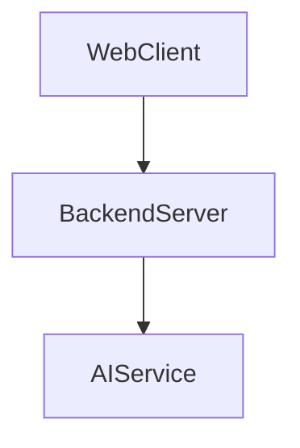
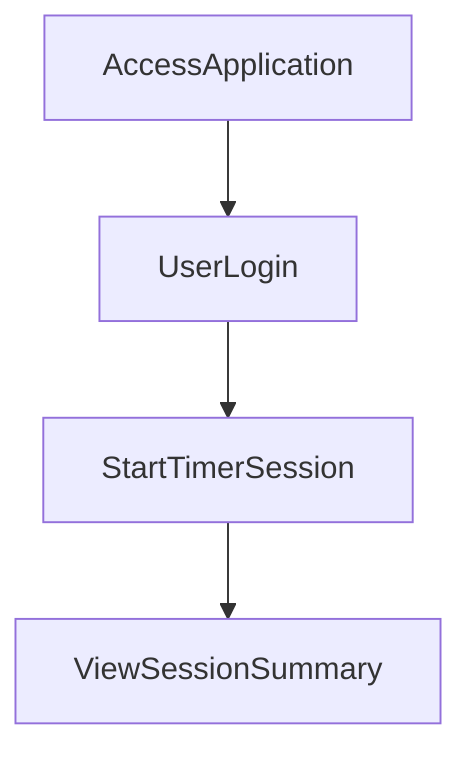

---

# 1. Overview

This project appears to be a web-based application focused on productivity and session management, possibly incorporating AI capabilities. It includes a user login system, a timer interface, and features for viewing history and summaries of sessions. The presence of `gemini.js` suggests integration with an AI service for tasks like summarization, likely applied to user activities recorded by the timer. The backend, served by `index.js`, handles user authentication and serves the various frontend pages.

---

# 2. Architecture Diagram (Mermaid)



---

# 3. Project Workflow (Mermaid + Explanation)

This workflow outlines a typical user interaction with the application, from accessing it to interacting with its core features.



**Access Application:** A user first navigates to the application's URL, loading the initial `index.html` or `login.html` page.

**User Login:** The user provides credentials through the `login.html` interface. These credentials are sent to the `POST /login` endpoint on the `BackendServer` for authentication.

**Start Timer Session:** After successful login, the user accesses the `timer.html` page to initiate a productivity session. This likely involves client-side JavaScript (`script.js`) managing the timer and potentially triggering an `alarm.mp3`.

**View Session Summary:** Upon completing or ending a timer session, the user can navigate to `summarize.html` or `history.html` to review their past sessions. It's inferred that `gemini.js` might process session data to provide AI-generated summaries, which are then displayed to the user.

---

# 4. API Endpoints

The project exposes the following API endpoints:

*   **`GET /hello`**:
    *   **Description**: A basic endpoint likely used for health checks or to confirm the server is running. It might return a simple "Hello" message.
    *   **Source**: `index.js`
*   **`POST /login`**:
    *   **Description**: Handles user authentication requests. Users send their login credentials to this endpoint, and the server processes them to verify identity.
    *   **Source**: `index.js`

---

# 5. Recent Commit History (Last 5)

The most recent commit history indicates a focus on documentation generation for this project, specifically integrating or running an AutoDocs tool. All five latest commits are related to `docs: auto-generate README using AutoDocs`, which means this README itself is a product of this recent development activity. This suggests the project is either newly setting up its documentation processes or undergoing a documentation refresh.

---

# 6. File Structure

```
📁 .git                          # Git version control metadata
📁 .vscode                       # Visual Studio Code specific settings
  📄 launch.json                 # Debugging configurations for VS Code
📄 about.html                    # Frontend page providing information about the application
📄 alarm.mp3                     # Audio file used for alerts or timer alarms
📄 Cover1.png                    # Image asset, potentially a cover image or branding element
📄 gemini.js                     # JavaScript file likely responsible for interacting with the Gemini AI service
📄 history.html                  # Frontend page to display past user activities or session history
📄 index.html                    # Main entry point or landing page for the web application
📄 index.js                      # Backend server file, handling API routes and serving static files
📄 login.html                    # Frontend page for user authentication
📄 README.md                     # This documentation file
📄 script.js                     # Client-side JavaScript for interactive functionality across pages
📄 style.css                     # Stylesheet for the application's visual presentation
📄 summarize.html                # Frontend page for displaying summaries, possibly AI-generated
📄 timer.html                    # Frontend page featuring the core timer functionality
```

---

# 7. AutoDocs Note

This documentation was automatically generated by AutoDocs.