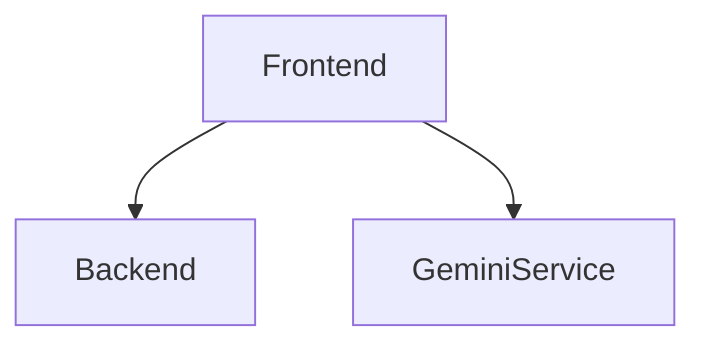
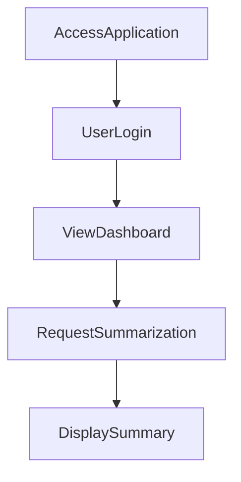

---

# 1. Overview

This project is a web application that offers various tools and functionalities, including user authentication, an AI-powered text summarization feature, and a timer/alarm utility. It combines a backend server, likely built with Node.js, to handle API requests such as user login, with a rich frontend built from multiple HTML pages, JavaScript, and CSS to provide the interactive user experience. The presence of `gemini.js` strongly suggests integration with the Google Gemini AI for its summarization capabilities.

---

# 2. Architecture Diagram (Mermaid)



---

# 3. Project Workflow (Mermaid + Explanation)



**Explanation:**
1.  **AccessApplication:** A user opens the web application, typically by navigating to `index.html` or `login.html`.
2.  **UserLogin:** The user provides their credentials on `login.html`, which are then sent to the `POST /login` API endpoint for authentication.
3.  **ViewDashboard:** Upon successful login, the user is directed to the main interface or dashboard of the application (e.g., `index.html`).
4.  **RequestSummarization:** From the dashboard or a dedicated page like `summarize.html`, the user initiates a text summarization request, likely utilizing the `gemini.js` integration.
5.  **DisplaySummary:** The application processes the request and presents the summarized text to the user.

---

# 4. API Endpoints

*   **GET /hello** (from `index.js`)
    A simple test or greeting endpoint, likely used to confirm the server is running or provide a basic welcome message.

*   **POST /login** (from `index.js`)
    Handles user authentication. Users send their login credentials to this endpoint to gain access to the application's features. The recent commit history indicates improvements were made to its response.

---

# 5. Recent Commit History (Last 5)

The recent commit history indicates that the project has undergone significant documentation efforts, with multiple commits dedicated to auto-generating the README. This suggests a focus on maintaining clear and up-to-date project information. The most recent functional change involved adding a `/hello` route and improving the response handling for the `/login` endpoint, indicating ongoing development and refinement of the backend API.

---

# 6. File Structure

```
📁 .git
📁 .vscode
📄 .gitignore
📄 about.html
📄 alarm.mp3
📄 Cover1.png
📄 gemini.js
📄 history.html
📄 index.html
📄 index.js
📄 login.html
📄 README.md
📄 script.js
📄 style.css
📄 summarize.html
📄 test.txt
📄 test1.txt
📄 test2.txt
📄 test3.txt
📄 timer.html
```

*   **`index.js`**: This is the core backend file, responsible for setting up the server and handling API routes like `/login` and `/hello`.
*   **`index.html`**: The main entry point or dashboard of the web application, serving as the primary user interface after login.
*   **`login.html`**: A dedicated HTML page for user authentication.
*   **`script.js`**: Contains client-side JavaScript logic, handling interactive elements and potentially making requests to the backend or external services.
*   **`style.css`**: Defines the visual styles and layout for the web application.
*   **`gemini.js`**: This file likely contains the logic for integrating with the Google Gemini AI service, probably for features such as text summarization.
*   **`summarize.html`**: An HTML page designed for the text summarization feature, allowing users to input text and receive summaries.
*   **`timer.html`**, **`alarm.mp3`**: These files suggest the presence of a timer or alarm functionality within the application.
*   **`about.html`**, **`history.html`**: Provide information about the project and display a history of user activities or generated content, respectively.
*   **`.vscode/`**: Contains configuration files specific to the Visual Studio Code editor, such as launch settings.

---

# 7. AutoDocs Note

This documentation was automatically generated by AutoDocs.

---