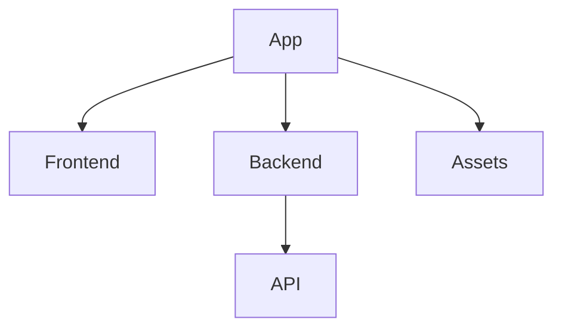
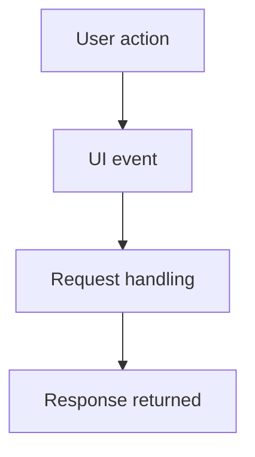

# 1. Overview
FocusZen appears to be a web application designed to enhance productivity and focus. It features a backend built with Express.js, handling API requests for functionalities like user authentication and potentially other data operations. The frontend is composed of various HTML pages (e.g., `login.html`, `timer.html`, `history.html`, `summarize.html`) styled with CSS and interactive JavaScript. The presence of `gemini.js` and a `summarize.html` strongly indicates integration with the Google Gemini API to provide AI-driven summarization capabilities, likely for text or content related to focus sessions. Key features likely include a productivity timer, task tracking, and AI assistance for summarizing information.

# 2. Architecture Diagram (Mermaid)
This diagram shows STATIC components only.



# 3. Project Workflow (Mermaid + explanation)



**Step 1: User action**
A user interacts with the FocusZen web application, for example, by clicking a login button, starting a timer, or submitting text for summarization.

**Step 2: UI event**
The frontend JavaScript detects this interaction as a UI event. It gathers any necessary data from the user interface.

**Step 3: Request handling**
The frontend sends an HTTP request (e.g., POST for login, GET for data) to the Express.js backend. The backend processes this request, which might involve authenticating users, interacting with external APIs like Gemini, or fetching/storing data.

**Step 4: Response returned**
After processing, the backend sends an HTTP response back to the frontend. The frontend then updates the user interface accordingly, such as displaying a success message, showing summarized text, or updating the timer's state.

# 4. API Endpoints
- **GET /hello** (from \index.js)
- **POST /login** (from \index.js)

# 5. Recent Commit History (Last 5)

- **fa576a0** — docs: auto-generate README using AutoDocs (yogithasivakumar)
- **ceeb686** — docs: auto-generate README using AutoDocs (yogithasivakumar)
- **b950f6c** — Add hello route and improve login response (yogithasivakumar)
- **ffa8bd2** — Initialize Express server with basic routes (yogithasivakumar)
- **7b72075** — commit test5 (yogithasivakumar)

# 6. File Structure

```
📁 .git
  📄 config
  📄 description
  📄 HEAD
  📁 hooks
    📄 applypatch-msg.sample
    📄 commit-msg.sample
    📄 fsmonitor-watchman.sample
    📄 post-update.sample
    📄 pre-applypatch.sample
    📄 pre-commit.sample
    📄 pre-merge-commit.sample
    📄 pre-push.sample
    📄 pre-rebase.sample
    📄 pre-receive.sample
    📄 prepare-commit-msg.sample
    📄 push-to-checkout.sample
    📄 sendemail-validate.sample
    📄 update.sample
  📄 index
  📁 info
    📄 exclude
  📁 logs
    📄 HEAD
    📁 refs
      📁 heads
        📄 main
      📁 remotes
        📁 origin
          📄 HEAD
  📁 objects
    📁 info
    📁 pack
      📄 pack-e080392d2a079d0e94218d48117ed75a54584ac0.idx
      📄 pack-e080392d2a079d0e94218d48117ed75a54584ac0.pack
      📄 pack-e080392d2a079d0e94218d48117ed75a54584ac0.rev
  📄 packed-refs
  📁 refs
    📁 heads
      📄 main
    📁 remotes
      📁 origin
        📄 HEAD
    📁 tags
📄 .gitignore
📁 .vscode
  📄 launch.json
📄 about.html
📄 alarm.mp3
📄 Cover1.png
📄 gemini.js
📄 history.html
📄 index.html
📄 index.js
📄 login.html
📄 README.md
📄 script.js
📄 style.css
📄 summarize.html
📄 test.txt
📄 test1.txt
📄 test2.txt
📄 test3.txt
📄 timer.html
```

# 7. AutoDocs Note
“This documentation was automatically generated using **AutoDocs AI Analyzer**.”