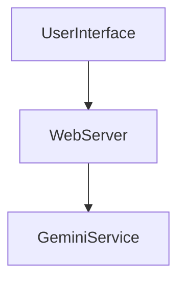
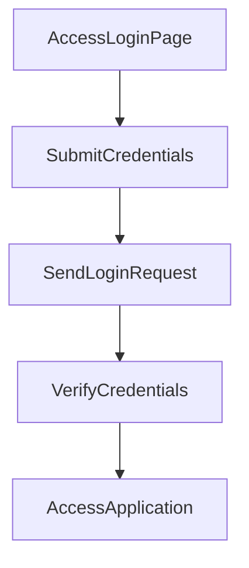

---

# 1. Overview

This project appears to be a web-based application focused on productivity, likely incorporating a timer, summarization features, and user authentication. The presence of `login.html`, `timer.html`, `summarize.html`, and `history.html` suggests a multi-functional user interface. Client-side logic is handled by `script.js` and styling by `style.css`. The application uses `index.js` as its backend server to manage API requests, including user login. The `gemini.js` file indicates integration with an external AI service, possibly for the summarization feature, while `alarm.mp3` is likely used for timer notifications.

---

# 2. Architecture Diagram (Mermaid)



---

# 3. Project Workflow (Mermaid + Explanation)

This flow describes a user authenticating and accessing the application.



**Explanation:**
1.  **AccessLoginPage**: A user navigates to the login page of the application (`login.html`).
2.  **SubmitCredentials**: The user enters their username and password into the login form.
3.  **SendLoginRequest**: The application sends the user's credentials to the backend server via a `POST /login` request.
4.  **VerifyCredentials**: The backend server processes the login request, validating the provided credentials.
5.  **AccessApplication**: If authentication is successful, the user gains access to the application's features, such as the timer or summarization tools.

---

# 4. API Endpoints

The project exposes the following API endpoints via `index.js`:

*   **GET /hello**
    *   **Description**: A simple endpoint that likely serves as a basic health check or a welcome message from the server. It confirms the backend is operational.
*   **POST /login**
    *   **Description**: This endpoint handles user authentication. It expects user credentials (e.g., username and password) to be sent in the request body, which the server then verifies to grant access to the application.

---

# 5. Recent Commit History (Last 5)

The recent commit history indicates a mix of documentation updates and development on specific test files:

*   `58c286b Create TEST2`: A new file named `TEST2` was created.
*   `9351e63 docs: auto-generate README using AutoDocs`: The documentation was updated by an automated process.
*   `a057bbc Add content to TEST1 file`: Content was added or modified within the `TEST1` file.
*   `284f053 docs: auto-generate README using AutoDocs`: The documentation was updated by an automated process.
*   `4362d68 docs: auto-generate README using AutoDocs`: The documentation was updated by an automated process.

This history shows recent activity around two files, `TEST1` and `TEST2`, suggesting ongoing development or testing, alongside frequent automated README updates.

---

# 6. File Structure

```
📁 .git
  📄 config
  📄 description
  📄 FETCH_HEAD
  📄 HEAD
  📁 hooks
    📄 applypatch-msg.sample
    📄 commit-msg.sample
    📄 fsmonitor-watchman.sample
    📄 post-update.sample
    📄 pre-applypatch.sample
    📄 pre-commit.sample
    📄 pre-merge-commit.sample
    📄 pre-push.sample
    📄 pre-rebase.sample
    📄 pre-receive.sample
    📄 prepare-commit-msg.sample
    📄 push-to-checkout.sample
    📄 sendemail-validate.sample
    📄 update.sample
  📄 index
  📁 info
    📄 exclude
  📁 logs
    📄 HEAD
    📁 refs
      📁 heads
        📄 main
      📁 remotes
        📁 origin
          📄 HEAD
  📁 objects
    📁 info
    📁 pack
      📄 pack-fb80f8700be0aa7a8ce48f9930ed026e0c872f8f.idx
      📄 pack-fb80f8700be0aa7a8ce48f9930ed026e0c872f8f.pack
      📄 pack-fb80f8700be0aa7a8ce48f9930ed026e0c872f8f.rev
  📄 packed-refs
  📁 refs
    📁 heads
      📄 main
    📁 remotes
      📁 origin
        📄 HEAD
    📁 tags
📄 .gitignore
📁 .vscode
  📄 launch.json
📄 about.html
📄 alarm.mp3
📄 Cover1.png
📄 gemini.js
📄 history.html
📄 index.html
📄 index.js
📄 login.html
📄 README.md
📄 script.js
📄 style.css
📄 summarize.html
📄 test.txt
📄 TEST1
📄 test1.txt
📄 TEST2
📄 test2.txt
📄 test3.txt
📄 timer.html
```

**Key Files and Directories:**

*   **`index.html`**: The main entry point or landing page for the web application.
*   **`login.html`**: Provides the user interface for authenticating into the application.
*   **`timer.html`**: Likely contains the functionality and interface for a timer or alarm feature.
*   **`summarize.html`**: Suggests a page dedicated to a text summarization tool.
*   **`history.html`**: Probably displays a log or history of user activities or summaries.
*   **`about.html`**: Contains information about the project or application.
*   **`style.css`**: Defines the visual styles and layout of the web pages.
*   **`script.js`**: Contains client-side JavaScript logic, interactivity, and dynamic content for the web pages.
*   **`index.js`**: Serves as the backend server, handling API requests (e.g., `/login`) and potentially serving static files.
*   **`gemini.js`**: Indicates integration with the Gemini AI service, likely for features like summarization.
*   **`alarm.mp3`**: An audio file used for sound notifications, possibly for the timer.
*   **`.vscode/`**: Contains configuration files specific to the Visual Studio Code editor, such as `launch.json` for debugging settings.
*   **`.git/`**: The standard Git repository directory, containing all version control metadata.
*   **`.gitignore`**: Specifies files and directories that Git should ignore and not track.
*   **`TEST1`, `TEST2`, `test.txt`, `test1.txt`, `test2.txt`, `test3.txt`**: These files appear to be temporary, experimental, or test files used during development.

---

# 7. AutoDocs Note

This documentation was automatically generated by AutoDocs.

---