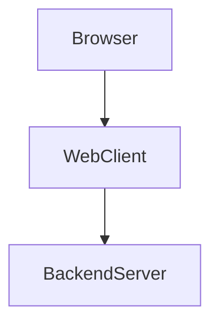
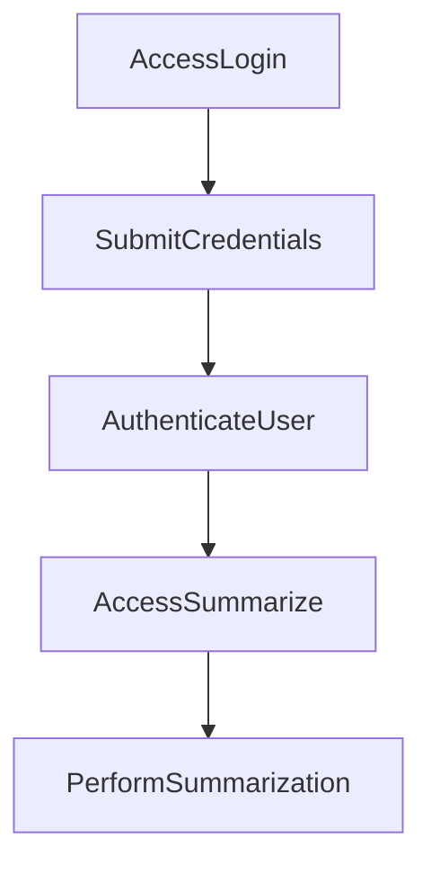

# 1. Overview

This project appears to be a basic web application providing a user interface for various utilities, including user authentication, a timer with an alarm, and potentially a text summarization feature. The presence of multiple HTML files (`index.html`, `login.html`, `timer.html`, `summarize.html`, `about.html`, `history.html`), along with `script.js` and `style.css`, indicates a client-side frontend. The `index.js` file acts as a simple backend server, handling API endpoints like user login. The inclusion of `gemini.js` and `summarize.html` strongly suggests an integration with the Google Gemini API for content summarization capabilities. Recent commits show ongoing testing activities and the integration of automated documentation.

# 2. Architecture Diagram (Mermaid)



# 3. Project Workflow (Mermaid + Explanation)

This workflow describes a user logging into the application and then utilizing a summarization feature.



**Workflow Explanation:**

1.  **Access Login:** A user navigates to the `login.html` page to access the application's authentication interface.
2.  **Submit Credentials:** The user inputs their username and password into the login form and attempts to log in.
3.  **Authenticate User:** The application sends the user's credentials to the `POST /login` API endpoint on the `BackendServer` for verification.
4.  **Access Summarize:** Upon successful authentication, the user is redirected or navigates to the `summarize.html` page, which provides the interface for text summarization.
5.  **Perform Summarization:** The user interacts with the summarization interface, likely submitting text that is then processed by the `BackendServer` (potentially via `gemini.js`) to generate a summary.

# 4. API Endpoints

*   **GET /hello** (from `index.js`)
    *   A simple endpoint likely used to check if the backend server is running and responsive. It might return a basic greeting or status message.
*   **POST /login** (from `index.js`)
    *   Handles user authentication requests. Users send their credentials to this endpoint, and the server validates them to grant access to protected parts of the application.

# 5. Recent Commit History (Last 5)

The recent commit history indicates a focus on creating temporary test files and the integration of an automated documentation tool:

*   **e78b565 Create Test 4**: Introduction of another test file, suggesting active development or testing.
*   **cc61612 docs: auto-generate README using AutoDocs**: A commit specifically for updating documentation, indicating a recent effort to automate this process.
*   **ef7a432 Create Test 3**: Another test file being added, continuing the pattern of creating temporary testing artifacts.
*   **c20657e docs: auto-generate README using AutoDocs**: Similar to the previous documentation commit, confirming recent work on README generation.
*   **58c286b Create TEST2**: The earliest of the recent commits, also focused on creating a test file.

Overall, the project seems to be under active development with testing in progress, and documentation is being automated.

# 6. File Structure

```
📁 .git
📁 .vscode
📄 .gitignore
📄 about.html
📄 alarm.mp3
📄 Cover1.png
📄 gemini.js
📄 history.html
📄 index.html
📄 index.js
📄 login.html
📄 README.md
📄 script.js
📄 style.css
📄 summarize.html
📄 Test 3
📄 Test 4
📄 test.txt
📄 TEST1
📄 test1.txt
📄 TEST2
📄 test2.txt
📄 test3.txt
📄 timer.html
```

**Major Folders and Files:**

*   **`.git`**: Contains all the necessary files and metadata for the Git version control system.
*   **`.vscode`**: Holds configuration files specific to Visual Studio Code, such as `launch.json` for debugging setups.
*   **`.gitignore`**: Specifies intentionally untracked files that Git should ignore.
*   **`index.html`**: The main entry point or landing page for the web application.
*   **`login.html`**: Provides the user interface for logging into the application.
*   **`about.html`**: An informational page, likely describing the project or its purpose.
*   **`history.html`**: Suggests a page for displaying past activities or records.
*   **`summarize.html`**: The user interface for the text summarization feature.
*   **`timer.html`**: The user interface for a timer functionality.
*   **`alarm.mp3`**: An audio file used for the alarm sound, likely in conjunction with `timer.html`.
*   **`script.js`**: Contains client-side JavaScript code that provides interactivity and dynamic behavior for the web pages.
*   **`style.css`**: Defines the visual styling and layout for the web application.
*   **`index.js`**: Serves as the backend server entry point, handling API routes like `/hello` and `/login`.
*   **`gemini.js`**: Suggests integration logic or an SDK for interacting with the Google Gemini API, likely used for the summarization feature.
*   **`Cover1.png`**: An image file, potentially used for branding, a hero section, or as a visual element within the application.
*   **`Test*` / `test*.txt`**: Various files prefixed with "Test" or "test" (e.g., `Test 3`, `test.txt`) are likely temporary files used for development, testing, or placeholders.
*   **`README.md`**: This documentation file, providing an overview of the project.

# 7. AutoDocs Note

This documentation was automatically generated by AutoDocs.