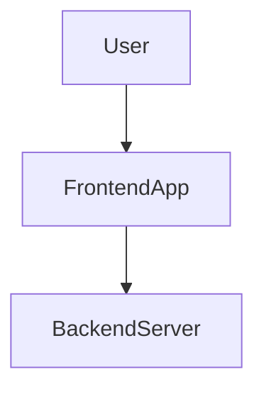
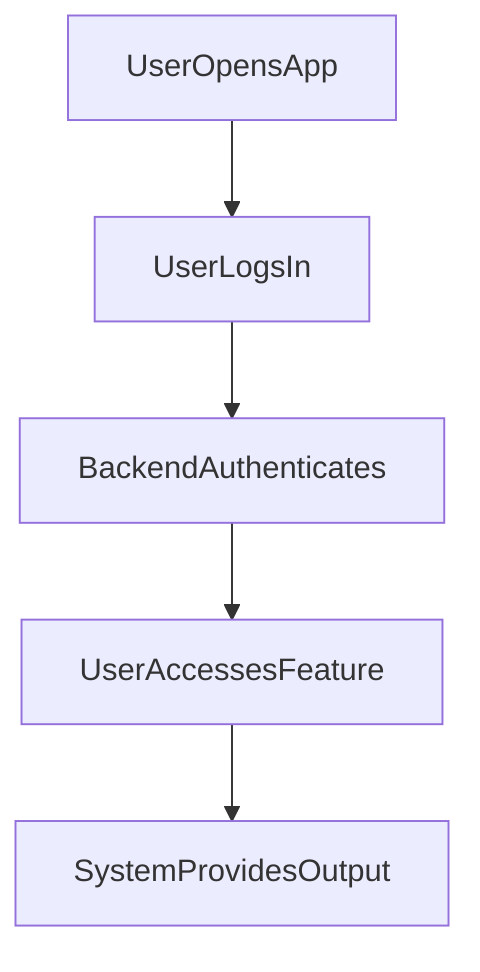

---

# 1. Overview

This project appears to be a web application offering various functionalities to users. It features a client-side interface built with HTML, CSS, and JavaScript, providing pages for user login, an 'about' section, a history log, a content summarization tool, and a timer/alarm feature. On the backend, an `index.js` file handles core server logic, including user authentication and a basic greeting endpoint. The presence of `gemini.js` suggests potential integration with an AI service, likely for the summarization feature. The application facilitates user interaction through a dynamic frontend supported by a minimal backend API.

---

# 2. Architecture Diagram (Mermaid)



---

# 3. Project Workflow (Mermaid + Explanation)

This diagram illustrates a common user interaction flow within the application, focusing on authentication and feature access.



**Explanation:**

*   **User Opens App**: A user navigates to the application's main page or the login page (`index.html` or `login.html`) in their web browser.
*   **User Logs In**: The user provides credentials through the `login.html` interface to gain access to personalized features.
*   **Backend Authenticates**: The application's backend server, specifically through the `POST /login` endpoint in `index.js`, processes the user's credentials to verify their identity.
*   **User Accesses Feature**: Upon successful authentication, the user can navigate to and utilize various application features, such as the timer (`timer.html`), summarization tool (`summarize.html`), or view their history (`history.html`).
*   **System Provides Output**: The application responds to the user's actions, for example, by starting a timer, displaying a summarized text, or listing historical data.

---

# 4. API Endpoints

The following API endpoints are identified in this project:

*   **GET /hello** (from `index.js`)
    *   **Description**: This endpoint likely serves as a basic test or a simple greeting message from the server. It can be used to confirm that the backend server is running and accessible.
*   **POST /login** (from `index.js`)
    *   **Description**: This endpoint handles user authentication. It expects user credentials (e.g., username and password) to be sent in the request body, processes them, and attempts to log the user into the application.

---

# 5. Recent Commit History (Last 5)

*   `0279b9d` docs: auto-generate README using AutoDocs
*   `59f02ea` docs: auto-generate README using AutoDocs
*   `c2af0c9` docs: auto-generate README using AutoDocs
*   `bf6a1fa` docs: auto-generate README using AutoDocs
*   `eb1e182` docs: auto-generate README using AutoDocs

These recent commits primarily indicate focused effort on integrating and testing an automatic documentation generation system, specifically AutoDocs. They suggest a phase where the project's README is being automated rather than active feature development or bug fixes.

---

# 6. File Structure

```
📁 .git
  📄 config
  📄 description
  📄 HEAD
  📁 hooks
    📄 applypatch-msg.sample
    📄 commit-msg.sample
    📄 fsmonitor-watchman.sample
    📄 post-update.sample
    📄 pre-applypatch.sample
    📄 pre-commit.sample
    📄 pre-merge-commit.sample
    📄 pre-push.sample
    📄 pre-rebase.sample
    📄 pre-receive.sample
    📄 prepare-commit-msg.sample
    📄 push-to-checkout.sample
    📄 sendemail-validate.sample
    📄 update.sample
  📄 index
  📁 info
    📄 exclude
  📁 logs
    📄 HEAD
    📁 refs
      📁 heads
        📄 main
      📁 remotes
        📁 origin
          📄 HEAD
  📁 objects
    📁 info
    📁 pack
      📄 pack-9067686dd80c19c4bb770ae6361daf7db5a6556e.idx
      📄 pack-9067686dd80c19c4bb770ae6361daf7db5a6556e.pack
      📄 pack-9067686dd80c19c4bb770ae6361daf7db5a6556e.rev
  📄 packed-refs
  📁 refs
    📁 heads
      📄 main
    📁 remotes
      📁 origin
        📄 HEAD
    📁 tags
📄 .gitignore
📁 .vscode
  📄 launch.json
📄 about.html
📄 alarm.mp3
📄 Cover1.png
📄 gemini.js
📄 history.html
📄 index.html
📄 index.js
📄 login.html
📄 README.md
📄 script.js
📄 style.css
📄 summarize.html
📄 timer.html
```

**Key Files and Their Roles:**

*   **`index.js`**: This is the main server-side JavaScript file, handling backend logic, including API routes (`/hello`, `/login`) and potentially serving static files.
*   **`index.html`**: The primary entry point or landing page for the web application.
*   **`login.html`**: Provides the user interface for logging into the application.
*   **`about.html`**: A static page likely containing information about the project or application.
*   **`history.html`**: Displays a log or historical data, possibly related to user actions or events within the app.
*   **`summarize.html`**: Offers an interface for a text summarization feature.
*   **`timer.html`**: Provides an interface for a timer or alarm functionality.
*   **`script.js`**: Contains client-side JavaScript logic, likely handling interactive elements and frontend functionality across various HTML pages.
*   **`style.css`**: Defines the visual styles and layout for the web application.
*   **`gemini.js`**: Suggests integration with an AI service or a specific library, most likely contributing to the summarization feature.
*   **`alarm.mp3`**: An audio file used for the alarm feature.
*   **`Cover1.png`**: An image file, possibly used for branding, a splash screen, or a background.
*   **`.vscode/launch.json`**: Configuration file for debugging the project within Visual Studio Code.
*   **`.gitignore`**: Specifies intentionally untracked files that Git should ignore.

---

# 7. AutoDocs Note

This documentation was automatically generated by AutoDocs.