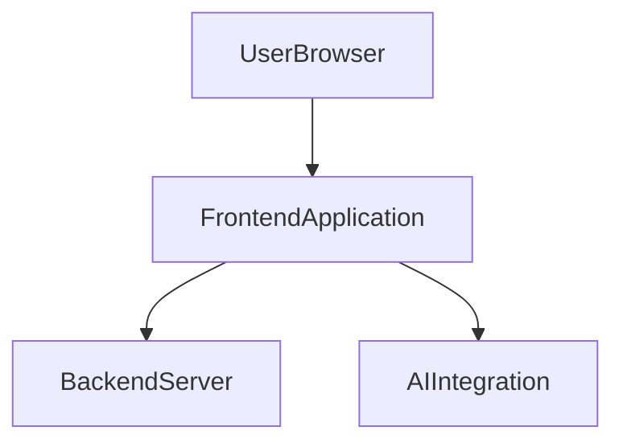
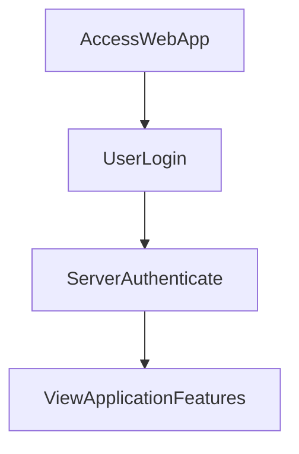

# 1. Overview

This project appears to be a web application, providing a range of functionalities including user authentication, information pages, and utility tools. It features a frontend built with HTML, CSS, and client-side JavaScript, connected to a Node.js backend server. The presence of `gemini.js` strongly suggests integration with an AI service, possibly for summarization or other intelligent features. Additionally, files like `timer.html` and `alarm.mp3` indicate a timer or reminder utility is part of the application's capabilities.

# 2. Architecture Diagram (Mermaid)



# 3. Project Workflow (Mermaid + Explanation)



**Explanation of Workflow:**

1.  **Access Web App:** A user initiates interaction by navigating to the application's main page in their browser.
2.  **User Login:** The user attempts to authenticate by submitting their credentials through the login page (`login.html`), which sends a `POST` request to the backend `/login` endpoint.
3.  **Server Authenticate:** The `index.js` backend server processes the login request, verifies the credentials, and responds with an authentication status.
4.  **View Application Features:** Upon successful authentication, the user is granted access to various application features, potentially viewing content from pages like `index.html`, `summarize.html`, or `timer.html`, and can interact with the server, for instance, via the `/hello` endpoint.

# 4. API Endpoints

*   **GET /hello**
    *   **Description:** This endpoint serves as a basic greeting or status check. It likely returns a simple message to confirm the server is running and accessible, or to provide a default welcome.
*   **POST /login**
    *   **Description:** Handles user authentication. It expects user credentials (e.g., username and password) to be sent in the request body, processes them, and attempts to log the user into the application. Upon successful login, it might establish a user session.

# 5. Recent Commit History (Last 5)

The recent commit history indicates a period of development involving the creation and subsequent removal of a test file, suggesting active testing and cleanup. The recurring "docs: auto-generate README using AutoDocs" commits highlight an ongoing effort to automate and maintain project documentation, pointing towards a focus on clarity and development efficiency.

# 6. File Structure

```
📁 .git                  - Git version control system metadata.
📁 .vscode                 - Configuration files for Visual Studio Code editor.
  📄 launch.json           - VS Code debugger launch configurations.
📄 about.html            - A frontend HTML page likely providing information about the project or application.
📄 alarm.mp3             - An audio file, most probably used for alert sounds within the application, especially with timer functionality.
📄 Cover1.png            - An image asset, potentially used as a banner, favicon, or visual element on the frontend.
📄 gemini.js             - A client-side or server-side JavaScript file, indicating integration with an AI service, possibly Google Gemini, for intelligent features.
📄 history.html          - A frontend HTML page designed to display user activity logs or historical data.
📄 index.html            - The main entry point or homepage of the web application.
📄 index.js              - The backend server script, handling API requests and server-side logic.
📄 login.html            - A dedicated frontend HTML page for user authentication and login.
📄 README.md             - The primary project documentation file (this file).
📄 script.js             - The main client-side JavaScript file, providing interactive functionality to the frontend.
📄 style.css             - The main stylesheet for the web application's user interface.
📄 summarize.html        - A frontend HTML page likely for a feature that summarizes text or data, possibly leveraging the `gemini.js` integration.
📄 timer.html            - A frontend HTML page dedicated to a timer or countdown functionality, potentially using `alarm.mp3`.
```

# 7. AutoDocs Note

This documentation was automatically generated by AutoDocs.