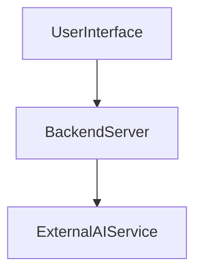
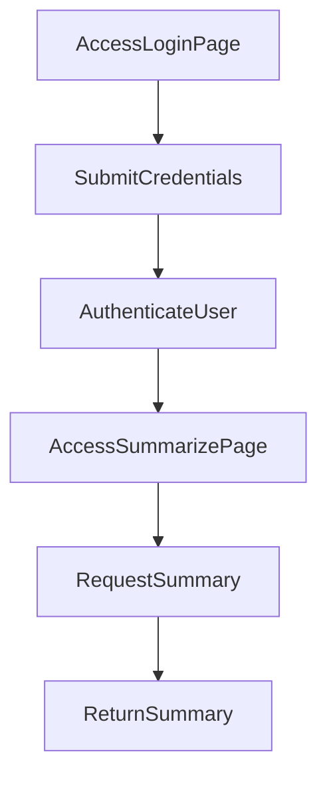

---

# 1. Overview

This project appears to be a web application providing various tools and utilities, with a focus on user interaction, authentication, and AI-powered summarization. It includes a frontend interface with multiple dedicated pages for different functionalities like a timer, an "about" section, a history log, and a summarization tool. On the backend, it exposes API endpoints for basic connectivity and user login, suggesting a user authentication system is in place. The presence of `gemini.js` strongly indicates integration with the Google Gemini AI service, likely for the summarization feature, making it an intelligent web utility.

---

# 2. Architecture Diagram (Mermaid)



---

# 3. Project Workflow (Mermaid + Explanation)

This workflow describes a user logging in and then utilizing the AI summarization feature.



**Workflow Explanation:**

1.  **Access Login Page:** A user navigates to the `login.html` page to begin their session.
2.  **Submit Credentials:** The user enters their username and password and submits the login form. This action triggers a `POST /login` request to the backend.
3.  **Authenticate User:** The backend server (`index.js`) receives the login request, processes the credentials, and verifies the user's identity.
4.  **Access Summarize Page:** Upon successful authentication, the user is directed to the `summarize.html` page, where they can input text for summarization.
5.  **Request Summary:** The user provides text and initiates a request for summarization. This request is sent to the backend, which then leverages the `gemini.js` logic to interact with an external AI service.
6.  **Return Summary:** The backend receives the summarized content from the AI service and sends it back to the user's browser, displaying the summary on the `summarize.html` page.

---

# 4. API Endpoints

The project exposes the following API endpoints:

*   **GET /hello**
    *   **Description:** A simple endpoint that likely returns a greeting message. It's typically used for testing server responsiveness or basic health checks.
    *   **Source:** `index.js`
*   **POST /login**
    *   **Description:** Handles user authentication. Users submit their credentials to this endpoint, and the server validates them to grant access to protected parts of the application.
    *   **Source:** `index.js`

---

# 5. Recent Commit History (Last 5)

The most recent commits indicate a strong focus on project documentation:

*   **269416e docs: auto-generate README using AutoDocs**
*   **6360be8 docs: auto-generate README using AutoDocs**
*   **45d4b5a docs: auto-generate README using AutoDocs**
*   **c966d26 docs: auto-generate README using AutoDocs**
*   **fa576a0 docs: auto-generate README using AutoDocs**

These entries show a recurring effort to integrate and refine an automated documentation generation process using AutoDocs, rather than revealing feature development.

---

# 6. File Structure

```
📁 .git
  📄 config
  📄 description
  📄 FETCH_HEAD
  📄 HEAD
  📁 hooks
    📄 applypatch-msg.sample
    📄 commit-msg.sample
    📄 fsmonitor-watchman.sample
    📄 post-update.sample
    📄 pre-applypatch.sample
    📄 pre-commit.sample
    📄 pre-merge-commit.sample
    📄 pre-push.sample
    📄 pre-rebase.sample
    📄 pre-receive.sample
    📄 prepare-commit-msg.sample
    📄 push-to-checkout.sample
    📄 sendemail-validate.sample
    📄 update.sample
  📄 index
  📁 info
    📄 exclude
  📁 logs
    📄 HEAD
    📁 refs
      📁 heads
        📄 main
      📁 remotes
        📁 origin
          📄 HEAD
  📁 objects
    📁 info
    📁 pack
      📄 pack-d1bb48762080cac852a449b899837857f12cfc3f.idx
      📄 pack-d1bb48762080cac852a449b899837857f12cfc3f.pack
      📄 pack-d1bb48762080cac852a449b899837857f12cfc3f.rev
  📄 packed-refs
  📁 refs
    📁 heads
      📄 main
    📁 remotes
      📁 origin
        📄 HEAD
    📁 tags
📄 .gitignore
📁 .vscode
  📄 launch.json
📄 about.html
📄 alarm.mp3
📄 Cover1.png
📄 gemini.js
📄 history.html
📄 index.html
📄 index.js
📄 login.html
📄 README.md
📄 script.js
📄 style.css
📄 summarize.html
📄 test.txt
📄 test1.txt
📄 test2.txt
📄 test3.txt
📄 timer.html
```

**Major Folders and Files:**

*   **`.git/`**: Contains all the necessary files and metadata for the Git version control system.
*   **`.vscode/`**: Holds configuration files specific to the Visual Studio Code editor, such as debug settings (`launch.json`).
*   **`*.html` files (e.g., `index.html`, `login.html`, `summarize.html`, `timer.html`, `about.html`, `history.html`)**: These are the frontend pages that make up the user interface of the web application, each serving a distinct purpose or feature.
*   **`alarm.mp3`**: An audio file, likely used in conjunction with the `timer.html` page to provide an audible alert for the timer functionality.
*   **`Cover1.png`**: An image file, possibly used for branding, a favicon, or as a visual element within the web application's design.
*   **`gemini.js`**: This JavaScript file is inferred to handle interactions with the Google Gemini AI service, likely supporting features like the summarization tool.
*   **`index.js`**: The main entry point for the backend server. It handles API routing, including the `/hello` and `/login` endpoints, and orchestrates server-side logic.
*   **`script.js`**: Contains general client-side JavaScript code for frontend interactivity, dynamic content updates, and event handling across the various HTML pages.
*   **`style.css`**: Defines the visual styling and layout for the entire web application, ensuring a consistent look and feel for the HTML pages.
*   **`README.md`**: This documentation file, providing an overview and details about the project.
*   **`test*.txt` files**: These appear to be temporary or placeholder text files, possibly used during development or for testing purposes.

---

# 7. AutoDocs Note

This documentation was automatically generated by AutoDocs.