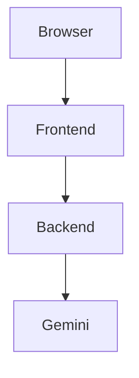
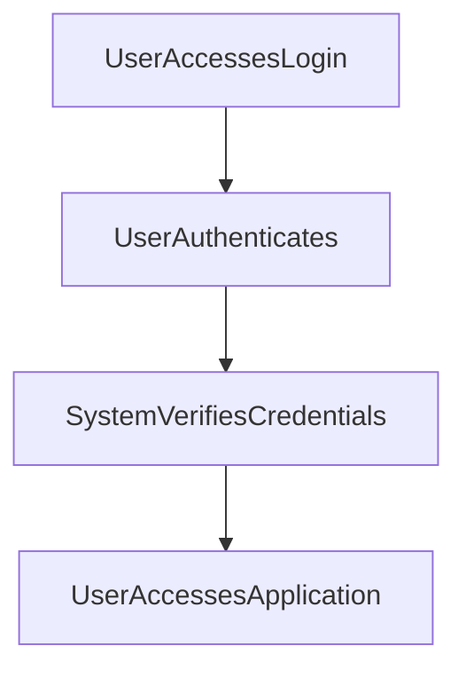

---

# 1. Overview

This project appears to be a web-based application focused on providing several interactive tools to a user, including a timer/alarm functionality and potentially content summarization. It features a frontend built with standard web technologies (HTML, CSS, JavaScript) that interacts with a backend server developed in Node.js, providing functionalities such as user login and basic API responses. The presence of `gemini.js` suggests an integration with the Google Gemini AI service, likely for enhanced features like text processing or summarization, as indicated by `summarize.html`. User authentication is a core component, managed through a dedicated login page and a backend API endpoint.

---

# 2. Architecture Diagram (Mermaid)



---

# 3. Project Workflow (Mermaid + Explanation)

This workflow describes how a user typically interacts with the application, focusing on the initial login process and subsequent access to features.



**Workflow Explanation:**

1.  **User Accesses Login:** A user navigates to the `login.html` page to begin interacting with the application.
2.  **User Authenticates:** The user enters their credentials (username/password) into the login form. This information is then sent to the backend.
3.  **System Verifies Credentials:** The backend server, via the `POST /login` API endpoint in `index.js`, receives and processes the submitted credentials to determine if they are valid.
4.  **User Accesses Application:** If authentication is successful, the user is granted access to the main application interface, likely `index.html`, from where they can navigate to features like the timer or summarization.

---

# 4. API Endpoints

The project exposes the following API endpoints through its `index.js` backend server:

*   **GET /hello**
    *   **Description:** A simple endpoint designed to return a greeting. This is typically used for testing server responsiveness or as a basic welcome message.
*   **POST /login**
    *   **Description:** Handles user authentication. It expects user credentials (e.g., username and password) in the request body, processes them, and responds with an indication of successful or failed login.

---

# 5. Recent Commit History (Last 5)

The recent commit history primarily highlights a strong focus on documentation automation. Four out of the last five commits are dedicated to automatically generating the `README.md` using AutoDocs, indicating an ongoing effort to maintain up-to-date and dynamic project documentation. The single non-documentation commit suggests a minor cleanup or removal of a test-related file, pointing to some level of active development or refactoring alongside the documentation work.

---

# 6. File Structure

```
📁 .git                          - Git version control metadata
📁 .vscode                       - Visual Studio Code specific configuration
📄 about.html                    - Frontend page providing information about the project
📄 alarm.mp3                     - Audio file used for alarm sounds, likely within the timer functionality
📄 Cover1.png                    - Image asset, possibly used for UI elements or branding
📄 gemini.js                     - JavaScript file likely handling integration with the Google Gemini API for AI features
📄 history.html                  - Frontend page for displaying historical data or activity
📄 index.html                    - The main landing page or dashboard for the web application
📄 index.js                      - The main backend server file, handling API routes and server logic
📄 login.html                    - Frontend page dedicated to user authentication
📄 README.md                     - This documentation file
📄 script.js                     - General frontend JavaScript logic, interacting with the DOM and backend
📄 style.css                     - Frontend styling for the web application's user interface
📄 summarize.html                - Frontend page potentially dedicated to text summarization functionality
📄 timer.html                    - Frontend page for a timer or alarm feature
```

---

# 7. AutoDocs Note

This documentation was automatically generated by AutoDocs.