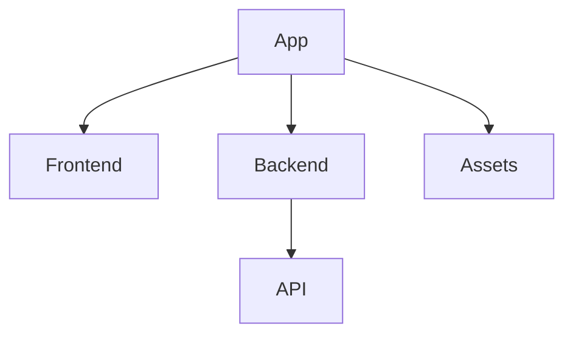
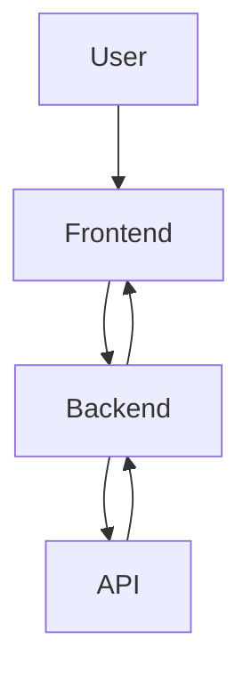

# 1. Overview
FocusZen is a web application designed to enhance productivity and focus. It appears to be a timer or Pomodoro-style application, offering features such as a timer, task history, and potentially AI-powered summarization. The project utilizes a Node.js Express backend to serve API endpoints and manage application logic, while the frontend is built with standard web technologies (HTML, CSS, JavaScript) to provide an interactive user interface. The inclusion of `gemini.js` suggests integration with Google's Gemini AI for advanced functionalities, likely for summarizing content or providing insights related to user activities.

# 2. Architecture Diagram (Mermaid)



# 3. Project Workflow (Mermaid + explanation)



**Explanation:**
1.  **User Interaction**: A user accesses the FocusZen application through their web browser, interacting with the frontend (HTML, CSS, JavaScript).
2.  **Frontend Request**: The frontend sends requests to the backend for various actions, such as logging in, starting a timer, or requesting a summary.
3.  **Backend Processing**: The Node.js Express backend (`index.js`) receives these requests, processes them, and may interact with internal logic or external services.
4.  **API Interaction**: For specific functionalities like user authentication or data retrieval, the backend communicates with its defined API endpoints. If AI capabilities are involved (e.g., summarization via `gemini.js`), the backend might interact with an external AI service.
5.  **Backend Response**: After processing, the backend sends a response back to the frontend.
6.  **Frontend Update**: The frontend receives the response and updates the user interface accordingly, displaying timer status, login success, or summarized content.

# 4. API Endpoints
-   **GET /hello** (from \index.js)
-   **POST /login** (from \index.js)

# 5. Recent Commit History (Last 5)

-   **ceeb686** — docs: auto-generate README using AutoDocs (yogithasivakumar)
-   **b950f6c** — Add hello route and improve login response (yogithasivakumar)
-   **ffa8bd2** — Initialize Express server with basic routes (yogithasivakumar)
-   **7b72075** — commit test5 (yogithasivakumar)
-   **784ee5f** — commit test5 (yogithasivakumar)

# 6. File Structure

```
📁 .git
  📄 config
  📄 description
  📄 HEAD
  📁 hooks
    📄 applypatch-msg.sample
    📄 commit-msg.sample
    📄 fsmonitor-watchman.sample
    📄 post-update.sample
    📄 pre-applypatch.sample
    📄 pre-commit.sample
    📄 pre-merge-commit.sample
    📄 pre-push.sample
    📄 pre-rebase.sample
    📄 pre-receive.sample
    📄 prepare-commit-msg.sample
    📄 push-to-checkout.sample
    📄 sendemail-validate.sample
    📄 update.sample
  📄 index
  📁 info
    📄 exclude
  📁 logs
    📄 HEAD
    📁 refs
      📁 heads
        📄 main
      📁 remotes
        📁 origin
          📄 HEAD
  📁 objects
    📁 info
    📁 pack
      📄 pack-2aa617a909b2fbaeb319c8a45d4c010d6886907e.idx
      📄 pack-2aa617a909b2fbaeb319c8a45d4c010d6886907e.pack
      📄 pack-2aa617a909b2fbaeb319c8a45d4c010d6886907e.rev
  📄 packed-refs
  📁 refs
    📁 heads
      📄 main
    📁 remotes
      📁 origin
        📄 HEAD
    📁 tags
📄 .gitignore
📁 .vscode
  📄 launch.json
📄 about.html
📄 alarm.mp3
📄 Cover1.png
📄 gemini.js
📄 history.html
📄 index.html
📄 index.js
📄 login.html
📄 README.md
📄 script.js
📄 style.css
📄 summarize.html
📄 test.txt
📄 test1.txt
📄 test2.txt
📄 test3.txt
📄 timer.html
```

# 7. AutoDocs Note
“This documentation was automatically generated using **AutoDocs AI Analyzer**.”