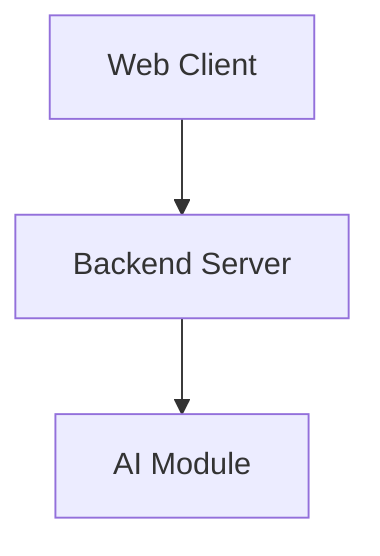
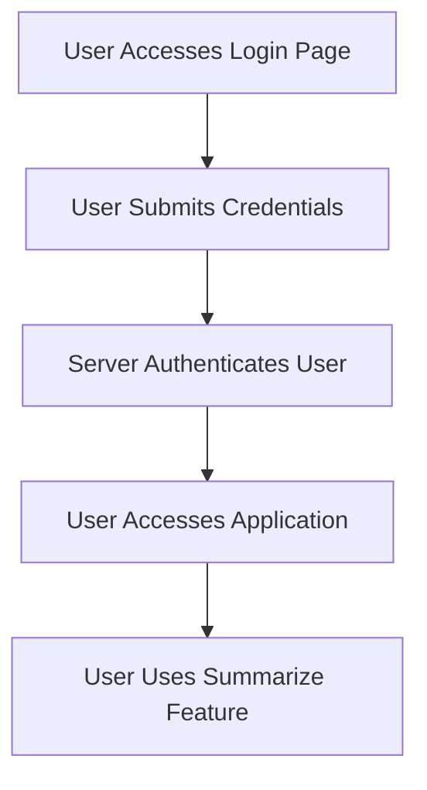

---

# 1. Overview

This project appears to be a web application designed to offer a suite of utility tools. It features a frontend interface built with standard web technologies (HTML, CSS, JavaScript) providing pages for general information (`about.html`), historical data (`history.html`), a timer functionality (`timer.html` with `alarm.mp3`), and a summarization tool (`summarize.html`). A key component, `gemini.js`, suggests the summarization feature might be powered by an AI model or a specific module. On the backend, an `index.js` file exposes API endpoints for basic server functionality and user authentication, as indicated by the `/login` route. The presence of `login.html` and the `POST /login` endpoint confirms user authentication is a core aspect, allowing users to access the application's various features.

---

# 2. Architecture Diagram (Mermaid)



**Explanation:**
- **Web Client**: Represents the browser-side application, encompassing the HTML pages (`index.html`, `login.html`, `summarize.html`, `timer.html`), styling (`style.css`), and client-side logic (`script.js`). Users interact directly with this component.
- **Backend Server**: Handles server-side logic and API requests. The `index.js` file serves the API endpoints like `/hello` and `/login`, processing requests from the Web Client and potentially interacting with other services.
- **AI Module**: This component, likely implemented in `gemini.js`, is responsible for specific intelligent tasks such as text summarization, as suggested by `summarize.html`. It receives requests from the Backend Server to perform these operations.

---

# 3. Project Workflow (Mermaid + Explanation)

This workflow outlines a typical user interaction involving login and accessing a feature.



**Explanation:**
1.  **User Accesses Login Page**: A user navigates to the `login.html` page to gain access to the application.
2.  **User Submits Credentials**: The user enters their username and password, which are then sent to the backend via the `POST /login` API endpoint.
3.  **Server Authenticates User**: The `index.js` backend receives the login request, validates the credentials, and, if successful, grants access.
4.  **User Accesses Application**: Upon successful authentication, the user is redirected or granted access to the main parts of the application, such as `index.html` or specific feature pages.
5.  **User Uses Summarize Feature**: The user navigates to `summarize.html` and interacts with the summarization tool, which likely involves the frontend sending text to the backend, which then utilizes the `AI Module` (`gemini.js`) for processing.

---

# 4. API Endpoints

The project exposes the following API endpoints, handled by `index.js`:

-   **GET /hello**
    -   **Description:** A basic endpoint to test server connectivity and responsiveness. It likely returns a simple greeting or status message to confirm the server is running.
-   **POST /login**
    -   **Description:** This endpoint is responsible for user authentication. It accepts user credentials (e.g., username and password) and validates them. Upon successful validation, it grants the user access to protected parts of the application.

---

# 5. Recent Commit History (Last 5)

-   `99abdd8 docs: auto-generate README using AutoDocs`
-   `a2283e8 docs: auto-generate README using AutoDocs`
-   `95d5b24 Delete test 1`
-   `2895a57 Create test 1`
-   `7cf131d docs: auto-generate README using AutoDocs`

The recent commit history indicates a period of focused documentation generation, with multiple commits related to "auto-generate README using AutoDocs". This suggests the project is at a stage where its documentation is being formalized or updated. Sandwiched between these documentation commits are two commits (`Create test 1`, `Delete test 1`) that point to a temporary test being introduced and subsequently removed. This could signify a brief testing phase or a cleanup of temporary development assets just before the documentation was finalized.

---

# 6. File Structure

```
📁 .git
  📄 config
  📄 description
  📄 HEAD
  📁 hooks
    📄 applypatch-msg.sample
    📄 commit-msg.sample
    📄 fsmonitor-watchman.sample
    📄 post-update.sample
    📄 pre-applypatch.sample
    📄 pre-commit.sample
    📄 pre-merge-commit.sample
    📄 pre-push.sample
    📄 pre-rebase.sample
    📄 pre-receive.sample
    📄 prepare-commit-msg.sample
    📄 push-to-checkout.sample
    📄 sendemail-validate.sample
    📄 update.sample
  📄 index
  📁 info
    📄 exclude
  📁 logs
    📄 HEAD
    📁 refs
      📁 heads
        📄 main
      📁 remotes
        📁 origin
          📄 HEAD
  📁 objects
    📁 info
    📁 pack
      📄 pack-4df752cad7a068de76d9015da355cafa34e33353.idx
      📄 pack-4df752cad7a068de76d9015da355cafa34e33353.pack
      📄 pack-4df752cad7a068de76d9015da355cafa34e33353.rev
  📄 packed-refs
  📁 refs
    📁 heads
      📄 main
    📁 remotes
      📁 origin
        📄 HEAD
    📁 tags
📄 .gitignore
📁 .vscode
  📄 launch.json
📄 about.html
📄 alarm.mp3
📄 Cover1.png
📄 gemini.js
📄 history.html
📄 index.html
📄 index.js
📄 login.html
📄 README.md
📄 script.js
📄 style.css
📄 summarize.html
📄 timer.html
```

-   **`.git/`**: Contains all the necessary objects and metadata for the Git version control system.
-   **`.vscode/`**: Holds configuration files specific to Visual Studio Code, such as `launch.json` for debugging settings.
-   **`about.html`**: An HTML page likely providing information about the project or application.
-   **`alarm.mp3`**: An audio file, probably used for the timer functionality within `timer.html`.
-   **`Cover1.png`**: An image file, possibly serving as a cover, banner, or decorative element for the application.
-   **`gemini.js`**: A JavaScript file that likely contains logic for a specific module, potentially related to AI or a summarization service given the presence of `summarize.html`.
-   **`history.html`**: An HTML page for displaying historical data or logs within the application.
-   **`index.html`**: The main entry point or homepage of the web application.
-   **`index.js`**: The primary JavaScript file for the backend server, handling API routes (like `/hello` and `/login`) and server-side logic.
-   **`login.html`**: An HTML page dedicated to user authentication and login.
-   **`README.md`**: The project's main documentation file.
-   **`script.js`**: A JavaScript file for client-side scripting, adding interactivity and dynamic behavior to the web pages.
-   **`style.css`**: The stylesheet for the application, defining its visual presentation and layout.
-   **`summarize.html`**: An HTML page providing an interface for a text summarization feature.
-   **`timer.html`**: An HTML page implementing a timer or alarm functionality.

---

# 7. AutoDocs Note

This documentation was automatically generated by AutoDocs.