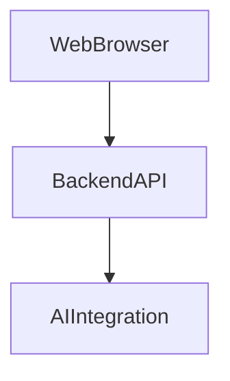
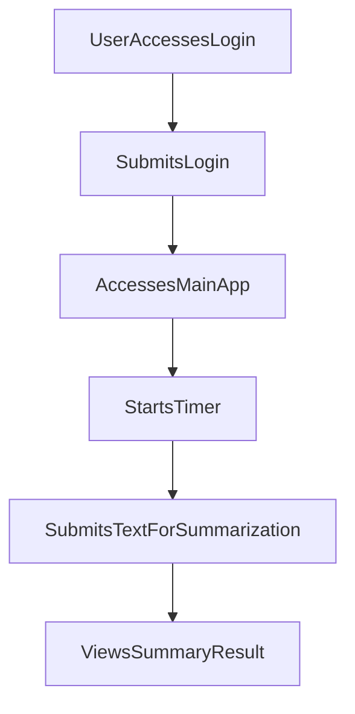

---

# 1. Overview

This project is a web-based application designed to enhance productivity, offering features such as a timer/alarm system and text summarization capabilities. It includes a user authentication mechanism, likely managed by a backend server (`index.js`), and integrates with a Gemini-based AI (`gemini.js`) for its intelligent text processing functionalities. The frontend, composed of various HTML pages (`index.html`, `login.html`, `timer.html`, `summarize.html`), JavaScript (`script.js`), and CSS (`style.css`), provides a comprehensive user interface for login, core application features, timer management, and text summarization.

---

# 2. Architecture Diagram (Mermaid)



This diagram illustrates the high-level components of the application. The **Web Browser** represents the client-side interface that users interact with. It communicates with the **Backend API** for various services, including authentication and potentially relaying requests to other services. The **AI Integration** node signifies the project's interaction with an external or internal AI service, inferred from the `gemini.js` file, likely for features such as text summarization.

---

# 3. Project Workflow (Mermaid + Explanation)

This diagram outlines a typical user interaction flow within the application.



**Explanation:**

1.  **User Accesses Login**: A user first navigates to the application, which presents them with the login page (`login.html`).
2.  **Submits Login**: The user enters their credentials (username/password) and submits the login form. This triggers a `POST /login` request to the backend.
3.  **Accesses Main App**: Upon successful authentication, the user is redirected to the main application interface (`index.html`).
4.  **Starts Timer**: From the main application, the user can navigate to the timer feature (`timer.html`) and initiate a countdown.
5.  **Submits Text For Summarization**: The user then accesses the summarization feature (`summarize.html`) and inputs text they wish to have summarized.
6.  **Views Summary Result**: The application processes the text, likely using the integrated AI, and displays the generated summary to the user.

---

# 4. API Endpoints

The project exposes the following API endpoints:

*   **`GET /hello`** (from `index.js`)
    *   This is a basic endpoint likely used for testing server connectivity or as a simple welcome message, confirming that the backend server is operational.
*   **`POST /login`** (from `index.js`)
    *   This endpoint handles user authentication. Users submit their credentials (e.g., username and password) to this endpoint to gain access to the application's authenticated features.

---

# 5. Recent Commit History (Last 5)

The most recent five commits indicate a focused effort on documentation. All entries are `docs: auto-generate README using AutoDocs`. This suggests that the project has recently implemented or refined an automated system for generating its `README.md` file, demonstrating a commitment to maintaining up-to-date and dynamic project documentation.

---

# 6. File Structure

```
📁 .git
  📄 config
  📄 description
  📄 HEAD
  📁 hooks
    📄 applypatch-msg.sample
    📄 commit-msg.sample
    📄 fsmonitor-watchman.sample
    📄 post-update.sample
    📄 pre-applypatch.sample
    📄 pre-commit.sample
    📄 pre-merge-commit.sample
    📄 pre-push.sample
    📄 pre-rebase.sample
    📄 pre-receive.sample
    📄 prepare-commit-msg.sample
    📄 push-to-checkout.sample
    📄 sendemail-validate.sample
    📄 update.sample
  📄 index
  📁 info
    📄 exclude
  📁 logs
    📄 HEAD
    📁 refs
      📁 heads
        📄 main
      📁 remotes
        📁 origin
          📄 HEAD
  📁 objects
    📁 info
    📁 pack
      📄 pack-78416d7e193be314d76d2012c5c8f794b911fbb5.idx
      📄 pack-78416d7e193be314d76d2012c5c8f794b911fbb5.pack
      📄 pack-78416d7e193be314d76d2012c5c8f794b911fbb5.rev
  📄 packed-refs
  📁 refs
    📁 heads
      📄 main
    📁 remotes
      📁 origin
        📄 HEAD
    📁 tags
📄 .gitignore
📁 .vscode
  📄 launch.json
📄 about.html
📄 alarm.mp3
📄 Cover1.png
📄 gemini.js
📄 history.html
📄 index.html
📄 index.js
📄 login.html
📄 README.md
📄 script.js
📄 style.css
📄 summarize.html
📄 timer.html
```

**Major Folders and Files:**

*   **`.git/`**: Contains all the necessary objects and metadata for Git to manage the project's version control.
*   **`.vscode/`**: Stores configurations specific to the VS Code editor, such as `launch.json` for debugging.
*   **`about.html`**: An HTML page likely providing information about the application or project.
*   **`alarm.mp3`**: An audio file used for alerts or notifications, typically for the timer functionality.
*   **`Cover1.png`**: An image asset, possibly a cover image, logo, or promotional graphic for the application.
*   **`gemini.js`**: A JavaScript file strongly suggesting integration with the Gemini AI service, likely handling requests or utility functions for AI-powered features.
*   **`history.html`**: An HTML page possibly displaying a log or history of user activities or past summaries/timers.
*   **`index.html`**: The main entry point HTML page for the web application after login.
*   **`index.js`**: This file acts as the backend server logic, handling API routes like `/hello` and `/login`.
*   **`login.html`**: The HTML page dedicated to user login.
*   **`README.md`**: This documentation file, automatically generated, providing an overview of the project.
*   **`script.js`**: General frontend JavaScript logic, handling interactive elements and client-side functionality for the various HTML pages.
*   **`style.css`**: The stylesheet for the frontend, defining the visual presentation and layout of the web application.
*   **`summarize.html`**: An HTML page dedicated to the text summarization feature.
*   **`timer.html`**: An HTML page implementing the timer or stopwatch functionality.
*   **`.gitignore`**: Specifies files and directories that Git should ignore and not track.

---

# 7. AutoDocs Note

This documentation was automatically generated by AutoDocs.