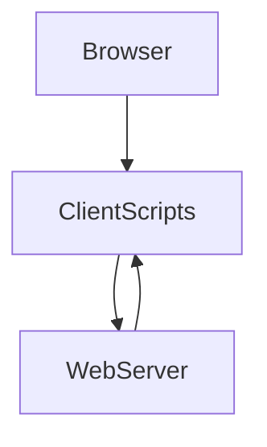
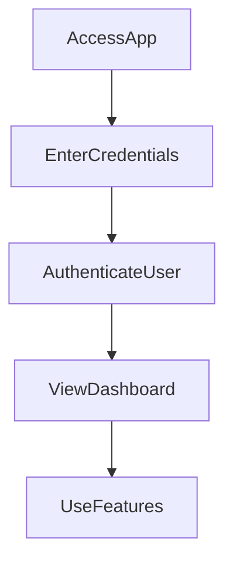

# 1. Overview

This project appears to be a client-side web application with a minimal backend server. It provides a user interface for various features including a timer, a summary tool, and a history log, along with an "about" section. User authentication is managed through a login page and a backend API. The presence of `gemini.js` suggests a specialized JavaScript functionality, possibly related to AI or a specific library. An `alarm.mp3` file indicates the timer feature likely includes audio alerts.

# 2. Architecture Diagram (Mermaid)



# 3. Project Workflow (Mermaid + Explanation)



**Explanation of Workflow:**
1.  **AccessApp**: A user navigates to the application's URL, loading `index.html` or `login.html`.
2.  **EnterCredentials**: If required, the user enters their username and password on the `login.html` page.
3.  **AuthenticateUser**: The client-side scripts send the credentials to the backend via the `POST /login` API endpoint for verification.
4.  **ViewDashboard**: Upon successful authentication, the user is redirected to the main application dashboard, likely `index.html`, where they can see an overview or navigation options.
5.  **UseFeatures**: From the dashboard, the user can navigate to and interact with specific features like the timer (`timer.html`), history (`history.html`), summary tool (`summarize.html`), or about page (`about.html`).

# 4. API Endpoints

*   **GET /hello** (from `index.js`)
    *   This endpoint likely serves as a basic health check or a simple welcome message from the server.
*   **POST /login** (from `index.js`)
    *   This endpoint is responsible for handling user authentication requests, processing submitted credentials to verify a user's identity.

# 5. Recent Commit History (Last 5)

*   `59f02ea docs: auto-generate README using AutoDocs`
*   `c2af0c9 docs: auto-generate README using AutoDocs`
*   `bf6a1fa docs: auto-generate README using AutoDocs`
*   `eb1e182 docs: auto-generate README using AutoDocs`
*   `2451600 docs: auto-generate README using AutoDocs`

The recent commit history indicates that the primary activity has been focused on setting up and refining automated documentation generation using AutoDocs. This suggests the project is either new, undergoing a documentation overhaul, or integrating automated tools. These commits do not reflect changes in core application functionality.

# 6. File Structure

```
📁 .git
📁 .vscode
📄 .gitignore
📄 README.md
📄 about.html
📄 alarm.mp3
📄 Cover1.png
📄 gemini.js
📄 history.html
📄 index.html
📄 index.js
📄 login.html
📄 script.js
📄 style.css
📄 summarize.html
📄 timer.html
```

**Explanation of Major Files and Folders:**

*   **`.git/`**: Contains all the necessary files for Git version control.
*   **`.vscode/`**: Stores configuration files specific to Visual Studio Code for this project, such as debugging setups.
*   **`.gitignore`**: Specifies intentionally untracked files that Git should ignore.
*   **`index.html`**: The main entry point and likely the home page of the web application.
*   **`login.html`**: Provides the user interface for logging into the application.
*   **`about.html`**: A page dedicated to providing information about the project or application.
*   **`history.html`**: Displays a history log, possibly of user actions or timed events.
*   **`summarize.html`**: A page dedicated to a summarization feature, implying text processing.
*   **`timer.html`**: Implements a timer functionality within the application.
*   **`script.js`**: Contains the primary client-side JavaScript logic, handling interactive elements and frontend behavior for the various HTML pages.
*   **`style.css`**: Defines the visual styles and layout of the web application.
*   **`index.js`**: Acts as the backend server, handling API requests like user login and potentially other server-side operations.
*   **`gemini.js`**: A specialized JavaScript file, possibly related to a specific feature, library, or AI integration.
*   **`alarm.mp3`**: An audio file used for alerts, most likely for the `timer.html` functionality.
*   **`Cover1.png`**: An image file, potentially used as a banner, logo, or cover for the application.
*   **`README.md`**: This documentation file.

# 7. AutoDocs Note

This documentation was automatically generated by AutoDocs.